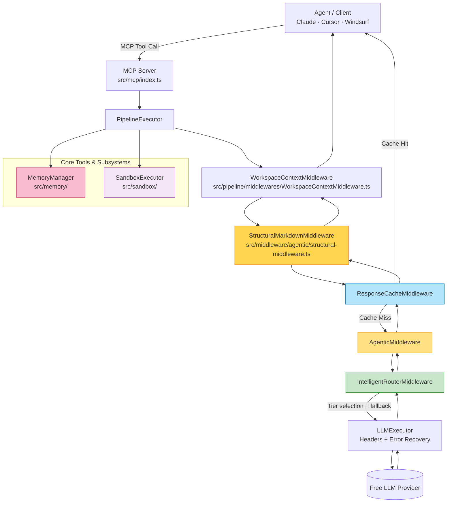

# free-llm-apis MCP Server

An [MCP (Model Context Protocol)](https://modelcontextprotocol.io/) server that exposes **six focused tools** for interacting with 60+ free LLM providers through a unified, agent-first interface.

---

## Architecture Overview



### Pipeline Order (v1.0.5)

| Stage | Component | Purpose |
|-------|-----------|---------|
| 1 | `WorkspaceContextMiddleware` | Resolves `wsHash`, performs **Pre-emptive Indexing** (v1.0.5), and injects session memory + Grep context into agentic requests. |
| 2 | `StructuralMarkdownMiddleware` | Inlines `file://` URIs and Markdown links; enforces structured response formats. |
| 3 | `ResponseCacheMiddleware` | LRU + disk cache; workspace-hash keyed with explicit `flush()` support. |
| 4 | `AgenticMiddleware` *(optional)* | Task decomposition (max 2 steps), research validation, and multi-turn state persistence. |
| 5 | `IntelligentRouterMiddleware` | Task-to-Tier routing with **Lighter Model Priority** (v1.0.5) for search/summary; handles **Hedged Execution** (v1.0.5) and adaptive timeouts. |
| 6 | `LLMExecutor` | Token estimation, quota tracking, and centralized circuit-breaking with bridged memory feedback. |

---

> **Strict rule for agents:** Only these six tools are part of the public API. Never request additional tools. Prefer internal middleware changes to extend capability.

| Tool | Purpose | Required Params | Key Optional Params |
|------|---------|----------------|---------------------|
| `use_free_llm` | Universal chat with deterministic steering; returns ONLY text content | `messages` | `model`, `keywords`, `agentic`, `sessionId`, **`workspace_root`** (recommended for project tasks) |
| `list_available_free_models` | Enumerate providers and models with metadata | *(none)* | `provider`, `available_only` |
| `get_token_stats` | Real-time per-provider usage and quota stats | *(none)* | — |
| `validate_provider` | Health-check and credential validation | `providerId` | — |
| `manage_memory` | Workspace-scoped memory: search/list/stats/clear | `action` | `workspace_root`, `query`, `limit` |
| `store_workspace_skill` | Explicitly capture structured findings and decisions | `name`, `what`, `why` | `workspace_root`, `files` |
| `index_workspace` | Proactively index workspace files for semantic search | `workspace_root` | `force` |


### Sample Agent Invocations

**Before any wide-context action — always check memory first:**
```ts
await client.callTool('manage_memory', {
  action: 'search',
  workspace_root: '/src/app',
  query: 'authentication middleware'
});
```

**Discover available models:**
```ts
await client.callTool('list_available_free_models', { available_only: true });
```

**Project-scoped task (agentic + workspace_root — ALWAYS use for project work):**
```ts
// ⚠️ Both `agentic: true` AND `workspace_root` are required for memory injection.
// Omitting either produces a context-blind response with no memory or session enrichment.
await client.callTool('use_free_llm', {
  messages: [{ role: 'user', content: 'Refactor the auth module based on [plan.md](file:///c:/project/plan.md)' }],
  agentic: true,
  workspace_root: '/abs/path/to/my-project',
  keywords: ['refactor', 'security', 'jwt']
});
```

**One-off query (no workspace, no memory — use for simple standalone Q&A):**
```ts
await client.callTool('use_free_llm', {
  messages: [{ role: 'user', content: 'What is the most efficient sorting algorithm?' }],
  keywords: ['coding', 'algorithms']
});
```

**Explicit model + keyword steering:**
```ts
await client.callTool('use_free_llm', {
  model: 'llama-3.3-70b-versatile',
  messages: [{ role: 'user', content: 'Explain JWT token expiry' }],
  keywords: ['security', 'tokens', 'jwt']
});
```


**Validate a provider before a critical workflow:**
```ts
await client.callTool('validate_provider', { providerId: 'groq' });
```

**Check token consumption:**
```ts
await client.callTool('get_token_stats');
```

---

## Middleware Dataflow

```
Tool Call (use_free_llm)
        │
        ▼
PipelineExecutor.execute(request, taskType)
        │
        ▼ ─────────────────────────────────────
StructuralMarkdownMiddleware  (v1.0.5 — Content Resolution)
  • **URI Resolution**: Detects and inlines `file://`, `artifact://` URIs
  • **Security Gate**: Rejects paths outside of authorized workspace/artifact roots
  • **Local Summarization**: TF-style zero-latency compression for large files
        │
        ▼ ─────────────────────────────────────
ResponseCacheMiddleware
  • **Deterministic Key**: `generateKey(request, workspaceHash)`
  • If cache hit → returns immediately (no LLM call)
  • If miss → next()
        │
        ▼ ─────────────────────────────────────
WorkspaceContextMiddleware (v1.0.5 — Context Injection)
  • **Pre-emptive Indexing**: Triggers background workspace scan for agentic tasks
  • **Vector Retrieval**: Semantic search across persistent workspace memory
  • **Grep Grounding**: Extracts TF-IDF relevant snippets from source code
  • **Intelligent Prompts**: Injects project-specific system instructions
        │
        ▼ ─────────────────────────────────────
AgenticMiddleware (v1.0.5 — Loop Orchestration)
  • **Search Suppression**: Disables `google_search` for subtasks after turn 0
  • **Goal Decomposition**: Limits plans to 4 steps to prevent token spirals
  • **Verification Loop**: Self-correcting feedback for failed assertions
        │
        ▼ ─────────────────────────────────────
IntelligentRouterMiddleware (v1.0.5 — Routing Logic)
  • **Gemini-Exclusive Search**: Forces `gemini-2.5-flash` if `google_search: true`
  • **Fallback Cascade**: Majority-voting classification → tiered model selection
  • **Greedy Budgeting**: Dynamically allocates time for hedged execution
        │
        ▼ ─────────────────────────────────────
LLMExecutor (v1.0.5 — Execution)
  • **Telemetry**: Updates RPM/TPM usage from `x-ratelimit-*` headers
  • **Circuit Breaking**: Cooldown penalties for failing providers
```
        │
        ▼ ─────────────────────────────────────
Response returned to agent
  • Simplified text content only (full JSON metadata stripped)
  • If multiple choices: Labeled as 'AGENT RESPONSE 1', 'AGENT RESPONSE 2', etc.
```

### Best Practices for Agent/Copilot Authors

1. **Always call `manage_memory` before wide-context steps** to retrieve relevant prior work.
2. **For ANY project-scoped task, pass BOTH `agentic: true` AND `workspace_root`** — these two fields unlock memory injection, session persistence, and context enrichment. Passing only one (or neither) produces a context-blind, stateless response.
4. **Call `validate_provider` or `get_token_stats`** before long-running workflows to confirm quota.
5. **Research/external-knowledge requests are auto-logged** by `AgenticMiddleware` — check server logs for `[RESEARCH-VALIDATION]` entries.
6. **Prefer `available_only:true`** with `list_available_free_models` to skip unconfigured providers.

---

## Adding a New Provider in <20 Lines

See [`docs/mcp-development.md`](docs/mcp-development.md#adding-new-providers) for the full guide. Here is the minimal pattern:

```typescript
// 1. src/providers/my-provider.ts  (~10 lines)
import { BaseProvider } from './base.js';

export class MyProvider extends BaseProvider {
  name = 'My AI';
  id = 'my-ai';
  baseURL = 'https://api.myai.com/v1/';
  envVar = 'MY_AI_API_KEY';
  models = [
    { id: 'my-model-1', name: 'My Model 1' },
  ];
  rateLimits = { rpm: 20, rpd: 1000 };
}

// 2. src/providers/registry.ts  (add one import + one line)
import { MyProvider } from './my-provider.js';
// Inside constructor: allProviders.push(new MyProvider());
```

That's it. The router, token tracker, fallback, and validation logic all pick it up automatically.

---

## Client Configurations

### Claude Desktop (`claude_desktop_config.json`)

```json
{
  "mcpServers": {
    "free-llm-apis": {
      "command": "node",
      "args": ["/path/to/mcp-server/dist/src/server.js"],
      "env": {
        "GROQ_API_KEY": "your_key",
        "GEMINI_API_KEY": "your_key"
      }
    }
  }
}
```

### Cursor (`.cursor/mcp.json`)

```json
{
  "mcpServers": {
    "free-llm-apis": {
      "command": "npx",
      "args": ["tsx", "/path/to/mcp-server/src/server.ts"],
      "env": {
        "GROQ_API_KEY": "your_key"
      }
    }
  }
}
```

### Windsurf (`~/.codeium/windsurf/mcp_config.json`)

```json
{
  "mcpServers": {
    "free-llm-apis": {
      "serverUrl": "http://localhost:3000/mcp",
      "headers": {}
    }
  }
}
```

*For HTTP transport, start the server with `npm run dashboard` (port 3000 by default).*

---

## Extension Points

### Adding Custom Middleware

Implement the `Middleware` interface and insert into the pipeline in `src/tools/use-free-llm.ts`:

```typescript
// src/pipeline/middlewares/my-middleware.ts
import type { Middleware, PipelineContext, NextFunction } from '../middleware.js';

export class MyMiddleware implements Middleware {
  name = 'MyMiddleware';
  async execute(context: PipelineContext, next: NextFunction): Promise<void> {
    // Pre-processing
    await next();
    // Post-processing
  }
}
```

### Strategy Patterns

| Strategy | Use Case | Implementation Hint |
|----------|----------|---------------------|
| **ReAct** | Reasoning + action loops | Extend `AgenticMiddleware` with action-observation cycles |
| **Plan-and-Execute** | Long multi-step tasks | Use `nowQueue`/`nextQueue` in agentic state |
| **Lite Mode** | Skip heavy middleware for simple calls | Set `agentic:false` and `fallback:true` with a pinned provider |
| **Cached-only** | Zero-latency repeat queries | Use workspace-aware cache keys; check hit rate with `manage_memory` stats |

---

## Quick Start

```bash
# Install and build
cd mcp-server
npm install
npm run build

# Configure providers (copy and fill .env.example)
cp .env.example .env

# (Optional) Install Python RestrictedPython
pip install RestrictedPython
```
> Follow [setup.md](docs/setup.md) for more details.

# Run in stdio mode (for Claude Desktop / Cursor)
```bash
npm run start
```

# Run with HTTP dashboard (port 3000)
```bash
npm run dashboard
```

# Docker
```bash
docker-compose up
```

See [`.env.example`](.env.example) for all supported API key variables.

---

## Agentic Benchmarks

The MCP server includes a comprehensive benchmarking suite to measure the efficiency of its intelligent subsystems, showing typical **token savings of 90-95%** across real-world scenarios.


### 🧪 System Evidence (Zero-Mock Proofs)

Verification of the system's intelligence is grounded in **live, execution-based traces**:
- See [SAMPLES.md](benchmarks/SAMPLES.md) for 7 verified scenarios including **Project State Synthesis**, **Multi-Step Decomposition**, and **Deep Memorization Retrieval**.
- See [INTAKE.md](benchmarks/INTAKE.md) for a breakdown of the agent-server intake protocol.

---

## Reliable Persistent Memory

The server features a **hardened long-term memory system** designed for long-running agentic tasks:

- **Persistent Health State**: Provider failures and circuit-breaker cooldowns are saved to disk. The router will "remember" that a provider is rate-limiting even if the server is restarted.
- **Identity Hashes**: Workspaces are identified by stable, path-based hashes. Your stored facts persist even if you modify your codebase.
- **Anti-Poisoning**: Strict `fs.existsSync` validation prevents memory pollution from hallucinated paths.
- **Explicit Harvesting**: Use `store_workspace_skill` to deliberately persist structured architectural decisions, research findings, or task summaries across sessions.
- **Proactive Grounding**: Use `index_workspace` to ensure semantic search results are grounded in the current codebase state.

---

## Reliability & Verification

Maintainers can verify header extraction and router scoring logic using provided scripts:

```bash
# Verify how specific providers return rate-limit headers (live test)
npx tsx scripts/verify-header-extraction.ts

# Verify the router's TokenFactor scoring logic against mock states
npx tsx scripts/token-factor-smoke-test.ts
```

---

## Directory Structure

```
mcp-server/
├── src/
│   ├── mcp/index.ts          # Tool registration and MCP handler
│   ├── tools/                # Six public tool implementations
│   │   ├── use-free-llm.ts
│   │   ├── list-models.ts
│   │   ├── get-token-stats.ts
│   │   ├── validate-provider.ts
│   │   ├── manage-memory.ts
│   │   ├── store-workspace-skill.ts
│   │   └── index-workspace.ts
│   ├── sandbox/              # Sandboxed code execution (QuickJS, Python)
│   ├── middleware/           # Pipeline middleware stages
│   │   └── agentic/          # Task decomposition + research validation
│   ├── pipeline/             # PipelineExecutor and Middleware interfaces
│   ├── providers/            # LLM provider implementations (15+ providers)
│   ├── memory/               # Persistent workspace memory
│   ├── cache/                # LRU + disk response cache
│   └── config/               # Environment and system configuration
├── docs/
│   ├── guide.md              # Architecture and routing details
│   ├── mcp-development.md    # Extension guide
│   ├── skill/                # Agent skill references and test cases
│   └── setup.md              # Initial setup guide
├── dashboard/                # Web dashboard (token stats, model list)
├── tests/                    # Vitest test suite
└── docker-compose.yml        # Container deployment
```
