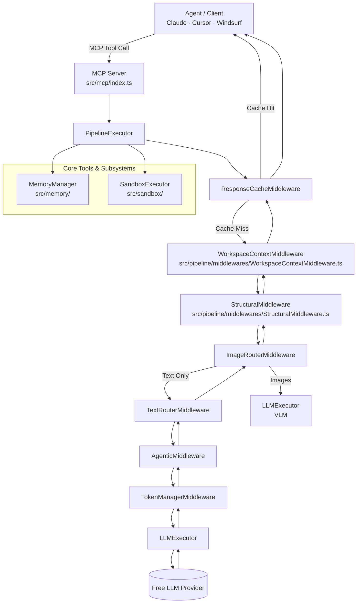

# free-llm-apis MCP Server

An [MCP (Model Context Protocol)](https://modelcontextprotocol.io/) server that exposes focused tools for interacting with 70+ free LLM providers through a unified, agent-first interface.

---

## Architecture Overview



### Pipeline Order (v1.0.6)

| Stage | Component | Purpose |
|-------|-----------|---------|
| 1 | `ResponseCacheMiddleware` | LRU + disk cache; workspace-hash keyed to prevent cross-project context leakage. |
| 2 | `WorkspaceContextMiddleware` | Resolves `wsHash`, performs **Pre-emptive Indexing**, and injects Grep grounding + vector context. |
| 3 | `StructuralMiddleware` | Injects full **Session Memory** (queue state + distilled knowledge) and enforces Markdown response formats. |
| 4 | `ImageRouterMiddleware` | Detects `file:///` URIs, parses image extensions, converts to base64, and routes to VLMs. |
| 5 | `TextRouterMiddleware` | Task-to-Tier routing using `TaskClassifier.autoClassify` to select optimal model. |
| 6 | `AgenticMiddleware` *(optional)* | Task decomposition, research validation, and multi-turn state persistence. |
| 7 | `TokenManagerMiddleware` | Enforces rate-limit tracking and quota gates. |
| 8 | `LLMExecutor` | HTTPS request; updates RPM/TPM usage from headers; handles circuit-breaking. |

---

> **Strict rule for agents:** Use only documented MCP tools. Prefer internal middleware changes to extend capability.

| Tool | Purpose | Required Params | Key Optional Params |
|------|---------|----------------|---------------------|
| `use_free_llm` | Universal chat with deterministic steering; returns ONLY text content | `messages` | `model`, `keywords`, `agentic`, `sessionId`, **`workspace_root`** |
| `execute_skill` | Runs a prompt grounded in a specific skill's instructions and reference files | `skill`, `input` | `model`, `workspace_root` |
| `vision_tool` | Analyze local images via a vision-capable model | `image_path` | `prompt`, `model` |
| `load_skill_prompt` | Dynamically load or search for skill prompts from the global index | `skill` | — |
| `get_token_stats` | Real-time per-provider usage and quota stats | *(none)* | — |
| `validate_provider` | Health-check and credential validation | `providerId` | — |
| `manage_memory` | Workspace-scoped memory: search/list/stats/clear | `action` | `workspace_root`, `query`, `limit` |
| `store_workspace_skill` | Explicitly capture structured findings and decisions | `name`, `what` | `workspace_root` |
| `index_workspace` | Proactively index workspace files for semantic search | `workspace_root` | `force` |

---

### Sample Agent Invocations

**Before any wide-context action — always check memory first:**
```ts
await client.callTool('manage_memory', {
  action: 'search',
  workspace_root: '/src/app',
  query: 'authentication middleware'
});
```

**Project-scoped task (agentic + workspace_root — ALWAYS use for project work):**
```ts
// ⚠️ Both `agentic: true` AND `workspace_root` are required for memory injection.
// Omitting either produces a context-blind response with no memory or session enrichment.
await client.callTool('use_free_llm', {
  messages: [{ role: 'user', content: 'Refactor the auth module based on [plan.md](file:///c:/project/plan.md)' }],
  agentic: true,
  workspace_root: '/abs/path/to/my-project',
  keywords: ['refactor', 'security', 'jwt']
});
```

**Execute a specific local skill:**
```ts
await client.callTool('execute_skill', {
  skill: 'ab-test-setup',
  input: 'Design an A/B test for the checkout button.',
  workspace_root: '/abs/path/to/my-project'
});
```

---

## Middleware Dataflow

```
Tool Call (use_free_llm)
        │
        ▼
PipelineExecutor.execute(request)
        │
        ▼ ─────────────────────────────────────
ResponseCacheMiddleware
  • If cache hit → returns immediately (no LLM call)
  • If miss → next()
        │
        ▼ ─────────────────────────────────────
WorkspaceContextMiddleware
  • **Pre-emptive Indexing**: Triggers background workspace scan for agentic tasks
  • **Vector Retrieval**: Semantic search across persistent workspace memory
  • **Grep Grounding**: Extracts TF-IDF relevant snippets from source code
        │
        ▼ ─────────────────────────────────────
StructuralMiddleware (Session Memory)
  • **Context Injection**: Prepends internal queue diagnostics and session distillation
  • **Format Enforcer**: Injects strict instructions for `file:path` response blocks
        │
        ▼ ─────────────────────────────────────
ImageRouterMiddleware
  • **Image Interception**: Detects `file:///` URIs with image extensions (.png, .jpg, etc.)
  • **VLM Routing**: Inlines base64 image data and routes to an available vision model
        │
        ▼ ─────────────────────────────────────
TextRouterMiddleware
  • **Task Classification**: Delegates to `TaskClassifier` for fast heuristic classification
  • **Model Tier Selection**: Routes prompt to the best text model tier
        │
        ▼ ─────────────────────────────────────
AgenticMiddleware (Loop Orchestration)
  • **Goal Decomposition**: Splits complex goals into discrete subtasks
  • **Verification Loop**: Self-correcting feedback for failed assertions
        │
        ▼ ─────────────────────────────────────
TokenManagerMiddleware
  • **Quota Checking**: Blocks requests if remaining tokens are insufficient
        │
        ▼ ─────────────────────────────────────
LLMExecutor (Execution)
  • **Telemetry**: Updates RPM/TPM usage from `x-ratelimit-*` headers
  • **Circuit Breaking**: Cooldown penalties for failing providers
        │
        ▼ ─────────────────────────────────────
Response returned to agent
```

---

## Client Configurations

### Claude Desktop (`claude_desktop_config.json`)

```json
{
  "mcpServers": {
    "free-llm-apis": {
      "command": "node",
      "args": ["/path/to/mcp-server/dist/src/server.js"],
      "env": {
        "GROQ_API_KEY": "your_key",
        "GEMINI_API_KEY": "your_key"
      }
    }
  }
}
```

### Cursor (`.cursor/mcp.json`)

```json
{
  "mcpServers": {
    "free-llm-apis": {
      "command": "npx",
      "args": ["tsx", "/path/to/mcp-server/src/server.ts"],
      "env": {
        "GROQ_API_KEY": "your_key"
      }
    }
  }
}
```
