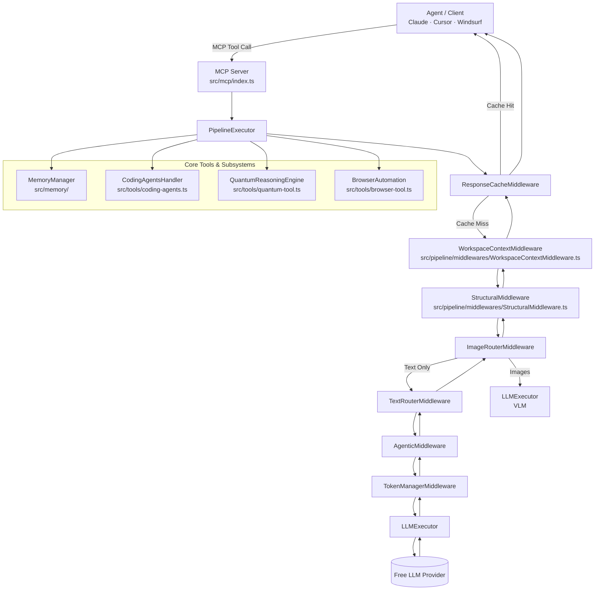

# free-llm-apis MCP Server (v1.1.0)

An enterprise-grade [MCP (Model Context Protocol)](https://modelcontextprotocol.io/) server exposing 14 zero-token-cost tools for interacting with 70+ free LLMs, local offline coding models, real browser sessions, and quantum-inspired multi-hypothesis reasoning engines.

---

## Architecture Overview


```mermaid
graph TD
    A[Agent / Client<br/>Claude · Cursor · Windsurf] -->|MCP Tool Call| B[MCP Server<br/>src/mcp/index.ts]
    B --> C[PipelineExecutor]
    
    subgraph "Core Tools & Subsystems"
        J[MemoryManager<br/>src/memory/]
        K[CodingAgentsHandler<br/>src/tools/coding-agents.ts]
        Q[QuantumReasoningEngine<br/>src/tools/quantum-tool.ts]
        BR[BrowserAutomation<br/>src/tools/browser-tool.ts]
    end

    C --> D[ResponseCacheMiddleware]
    D -->|Cache Miss| E[WorkspaceContextMiddleware<br/>src/pipeline/middlewares/WorkspaceContextMiddleware.ts]
    E --> F[StructuralMiddleware<br/>src/pipeline/middlewares/StructuralMiddleware.ts]
    F --> G[ImageRouterMiddleware]
    G -->|Text Only| H[TextRouterMiddleware]
    G -->|Images| I[LLMExecutor<br/>VLM]
    H --> J1[AgenticMiddleware]
    J1 --> K1[TokenManagerMiddleware]
    K1 --> L1[LLMExecutor]
    L1 --> M1[(Free LLM Provider)]

    C --> J
    C --> K
    C --> Q
    C --> BR
    
    D -->|Cache Hit| A
    M1 --> L1 --> K1 --> J1 --> H --> G --> F --> E --> D --> A
```

### Pipeline Order (v1.1.0)

| Stage | Component | Purpose |
|-------|-----------|---------|
| 1 | `ResponseCacheMiddleware` | LRU + disk cache; workspace-hash keyed to prevent cross-project context leakage. |
| 2 | `WorkspaceContextMiddleware` | Resolves `wsHash`, performs **Pre-emptive Indexing**, and injects Grep grounding + vector context. |
| 3 | `StructuralMiddleware` | Injects full **Session Memory** (queue state + distilled knowledge) and enforces Markdown response formats. |
| 4 | `ImageRouterMiddleware` | Detects `file:///` URIs, parses image extensions, converts to base64, and routes to VLMs. |
| 5 | `TextRouterMiddleware` | **Quantum-Inspired Model Routing & State Collapse** using normalized state vector probability matrices. |
| 6 | `AgenticMiddleware` *(optional)* | DAG subtask decomposition, research validation, and multi-turn state persistence. Time-budgeted (`MCP_SUBTASK_BUDGET_MS`, default 20s) with async background execution. |
| 7 | `TokenManagerMiddleware` | Enforces rate-limit tracking and quota gates with live disk synchronization. |
| 8 | `LLMExecutor` | HTTPS requests, telemetry header parsing (`x-ratelimit-*`), circuit-breaking cooldowns, and seamless fallbacks. |

---

## 🛠️ Complete 14-Tool MCP Suite

> **Strict rule for agents:** Use only documented MCP tools. Prefer internal middleware changes to extend capability.

| Tool | Category | Primary Action / Purpose | Key Parameters |
|---|---|---|---|
| `use_free_llm` | Chat & Orchestration | Universal chat completion, single-turn Q&A, and multi-step agentic DAG execution | `messages`, `agentic`, `workspace_root`, `action` (`run`\|`continue`\|`status`\|`abort`), `resume_input` |
| `coding_agents` | Refactoring & Patching | Multi-file refactoring, VectorStore TF-IDF discovery, Hashline diffs & Polyglot LSP checks | `goal`, `workspaceRoot`, `dryRun`, `topKFiles`, `sessionId`, `astEditOps`, `resolve` (`apply`\|`discard`\|`rollback`) |
| `local_llm_patch` | Offline Local Coding | 100% offline single-file patching powered by local Ollama coding models with 0 API cost | `action` (`apply_patch`\|`revert_patch`\|`audit_ast`), `target_file`, `instructions`, `model` |
| `quantum_tool` | Multi-Branch Reasoning | Multi-hypothesis reasoning circuits with gate operators ($H, X, R_Y, CNOT, CZ$) and state collapse | `action` (`setup`\|`step`\|`pause`\|`continue`\|`modify`\|`analyze`), `preset`, `circuit`, `params` |
| `browser_tool` | Web Automation | Headless Playwright automation, DOM snapshots, private API intercept/replay, and table scraping | `action` (`navigate`\|`snapshot`\|`click`\|`network`\|`api_replay`\|`extract`), `url`, `sessionId` |
| `cyber_tool` | Security & CTF | Tool syntax lookups, reconnaissance coaching, and persistent decision-tree graphing | `action` (`lookup`\|`suggest`\|`graph_action`\|`export_report`), `toolName`, `category` |
| `vision_tool` | Multimodal Inspection | Visual UI testing, bounding box extraction, flowchart parsing, and image diff regression | `image_path`, `action` (`analyze_ui`\|`extract_diagram`\|`compare_diff`\|`inspect_image`) |
| `execute_skill` | Specialized Skills | Runs prompts grounded with strict `SKILL.md` rules, references, and operational constraints | `skill`, `input`, `workspace_root` |
| `load_skill_prompt` | Prompt Catalogs | Search and load skill system prompts from the local repository or bundled Hermes catalog | `skill`, `type` (`skill`\|`persona`), `search` |
| `manage_memory` | Long-Term Memory | Query, store, and manage workspace vector memory, ADR decisions, and wiki documentation | `action` (`search`\|`save`\|`read_adr`\|`write_adr`\|`wiki_read`\|`wiki_write`), `workspace_root` |
| `index_workspace` | Vector Embedding | Proactively builds or refreshes the local vector database index across project source files | `workspace_root`, `force` |
| `store_workspace_skill` | Skill Authoring | Explicitly saves structured agent skills following the Agent Skills specification | `name`, `description`, `content`, `workspace_root` |
| `validate_provider` | Diagnostics | Health-check API credentials, measure network latency, and test provider responsiveness | `provider` (`gemini`\|`groq`\|`openrouter`\|`ollama`\|`cohere`\|...) |
| `get_token_stats` | Telemetry & Quotas | Live in-memory rate limit trackers merged with durable disk persistence | *(none)* |

---

### Sample Agent Invocations

**Before any wide-context action — always check memory first:**
```ts
await client.callTool('manage_memory', {
  action: 'search',
  workspace_root: '/src/app',
  query: 'authentication middleware'
});
```

**Project-scoped task (agentic + workspace_root — ALWAYS use for project work):**
```ts
// ⚠️ Both `agentic: true` AND `workspace_root` are required for memory injection.
// Omitting either produces a context-blind response with no memory or session enrichment.
await client.callTool('use_free_llm', {
  messages: [{ role: 'user', content: 'Refactor the auth module based on [plan.md](file:///c:/project/plan.md)' }],
  agentic: true,
  workspace_root: '/abs/path/to/my-project',
  keywords: ['refactor', 'security', 'jwt']
});
```

**Poll a long-running agentic session instead of re-sending the full prompt:**
```ts
await client.callTool('use_free_llm', {
  messages: [{ role: 'user', content: '' }],
  sessionId: 'my-project-session',
  action: 'status'
});
```

**Execute a specific local skill:**
```ts
await client.callTool('execute_skill', {
  skill: 'ab-test-setup',
  input: 'Design an A/B test for the checkout button.',
  workspace_root: '/abs/path/to/my-project'
});
```

---

## Long-Running / Background Execution

Many MCP clients (code editors especially) kill a tool call at ~30s. `AgenticMiddleware` runs
against a wall-clock budget (`MCP_SUBTASK_BUDGET_MS`, default 20000ms) instead of blocking until
every subtask finishes:

- If the budget is hit mid-run, `use_free_llm` returns immediately with whatever subtasks
  completed plus a resume handle, and **keeps executing the remaining subtasks in the
  background** on the server.
- Re-calling `use_free_llm` with the same `sessionId` while that background run is still active
  returns a status snapshot (completed/remaining count, last finished subtask) instead of
  starting a second concurrent run — so a client's timeout-and-retry is safe and doubles as
  polling.
- Once the background run finishes, the next call for that `sessionId` returns the rest of the
  result (or, if nothing changed, simply proceeds normally — no explicit action required).

Control this explicitly via the optional `action` param on `use_free_llm`:

| `action` | Behavior |
|---|---|
| `run` *(default)* | Normal call, subject to the time budget above. |
| `status` | Instantly reports whether a background run is active and how much is done — no LLM call. |
| `continue` | Resumes a paused/yielded queue. Equivalent to replying with `continue <promptId> ...`. |
| `abort` | Cancels an in-progress background run; the queue stays resumable via `continue`. |

The legacy text convention (`continue <PROMPT_ID> <output>`) still works unchanged for
terminal-command pauses and failed-subtask pauses (see [docs/skill/SKILL.md](docs/skill/SKILL.md), "⚠️ Agentic Behavior & Limits") — `action` is additive, not a replacement.

---

## Middleware Dataflow

```
Tool Call (use_free_llm)
        │
        ▼
PipelineExecutor.execute(request)
        │
        ▼ ─────────────────────────────────────
ResponseCacheMiddleware
  • If cache hit → returns immediately (no LLM call)
  • If miss → next()
        │
        ▼ ─────────────────────────────────────
WorkspaceContextMiddleware
  • **Pre-emptive Indexing**: Triggers background workspace scan for agentic tasks
  • **Vector Retrieval**: Semantic search across persistent workspace memory
  • **Grep Grounding**: Extracts TF-IDF relevant snippets from source code
        │
        ▼ ─────────────────────────────────────
StructuralMiddleware (Session Memory)
  • **Context Injection**: Prepends internal queue diagnostics and session distillation
  • **Format Enforcer**: Injects strict instructions for `file:path` response blocks
        │
        ▼ ─────────────────────────────────────
ImageRouterMiddleware
  • **Image Interception**: Detects `file:///` URIs with image extensions (.png, .jpg, etc.)
  • **VLM Routing**: Inlines base64 image data and routes to an available vision model
        │
        ▼ ─────────────────────────────────────
TextRouterMiddleware
  • **Task Classification**: Delegates to `TaskClassifier` for fast heuristic classification
  • **Model Tier Selection**: Routes prompt to the best text model tier
        │
        ▼ ─────────────────────────────────────
AgenticMiddleware (Loop Orchestration)
  • **Goal Decomposition**: Splits complex goals into discrete subtasks
  • **Verification Loop**: Self-correcting feedback for failed assertions
        │
        ▼ ─────────────────────────────────────
TokenManagerMiddleware
  • **Quota Checking**: Blocks requests if remaining tokens are insufficient
        │
        ▼ ─────────────────────────────────────
LLMExecutor (Execution)
  • **Telemetry**: Updates RPM/TPM usage from `x-ratelimit-*` headers
  • **Circuit Breaking**: Cooldown penalties for failing providers
        │
        ▼ ─────────────────────────────────────
Response returned to agent
```

---

## Client Configurations

### Claude Desktop (`claude_desktop_config.json`)

```json
{
  "mcpServers": {
    "free-llm-apis": {
      "command": "node",
      "args": ["/path/to/mcp-server/dist/src/server.js"],
      "env": {
        "GROQ_API_KEY": "your_key",
        "GEMINI_API_KEY": "your_key"
      }
    }
  }
}
```

### Cursor (`.cursor/mcp.json`)

```json
{
  "mcpServers": {
    "free-llm-apis": {
      "command": "npx",
      "args": ["tsx", "/path/to/mcp-server/src/server.ts"],
      "env": {
        "GROQ_API_KEY": "your_key"
      }
    }
  }
}
```
