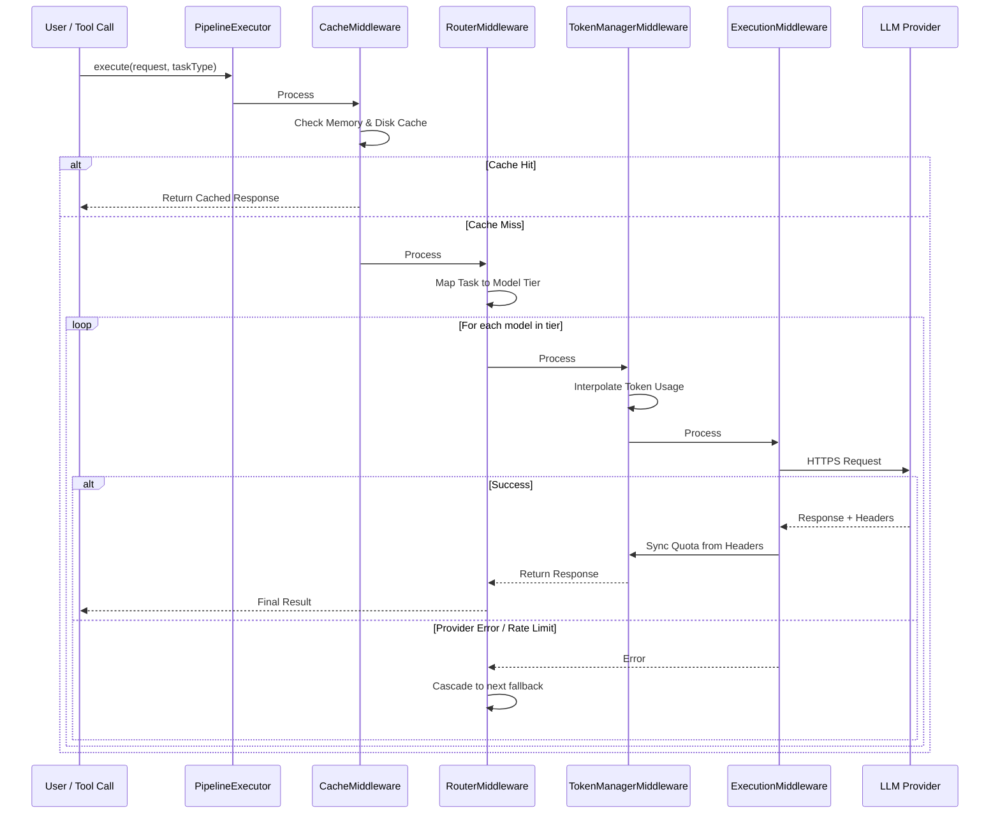
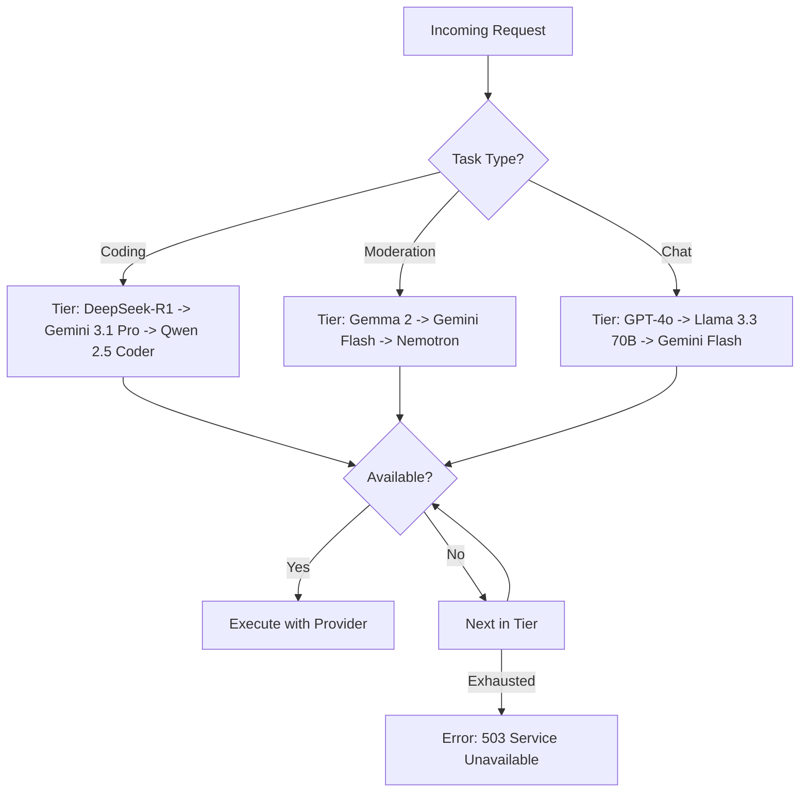
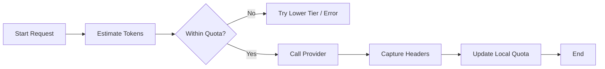

# Workflow & Architecture Guide

This guide explains the inner workings of the Intelligent LLM Orchestration Pipeline, including routing logic, token management, and middleware execution.

## 1. Orchestration Pipeline Flow

The system uses a Starlette-inspired middleware pipeline. Every request passes through a series of "layers" before reaching the LLM provider.

## 2. Intelligent Routing Logic

The `IntelligentRouterMiddleware` dynamically maps abstract tasks to a prioritized list of models. If the first choice is unavailable (e.g., missing API key or rate limited), it cascades to the next best option.

## 3. Token Management & Synchronization

The pipeline maintains a local "interpolated" token count to prevent overwhelming providers and hitting hard limits.

1.  **Local Estimation**: Before a request, `js-tiktoken` estimates the input tokens.
2.  **Proactive Blocking**: If the estimated usage exceeds the remaining quota, the request is blocked or routed elsewhere.
3.  **Response Sync**: After a successful call, the `TokenManagerMiddleware` reads `x-ratelimit-remaining-tokens` (and similar headers) to update the ground truth.

## 4. MCP Tools Interaction

The pipeline is exposed via the `use_free_llm` tool.

- **Request**: `{ model: string, prompt: string, task?: TaskType }`
- **Logic**: The tool initializes the `PipelineExecutor` with a standard stack of middlewares.
- **Monitoring**: Use the `get_token_stats` tool to view the current state of these quotas in real-time.
