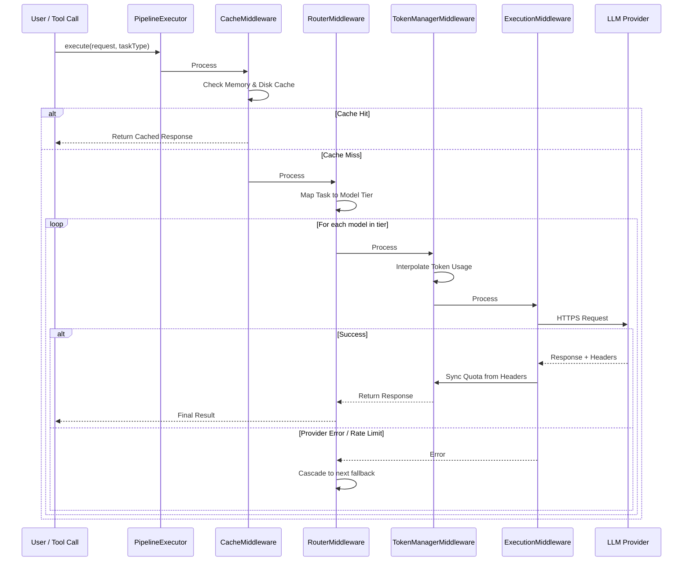
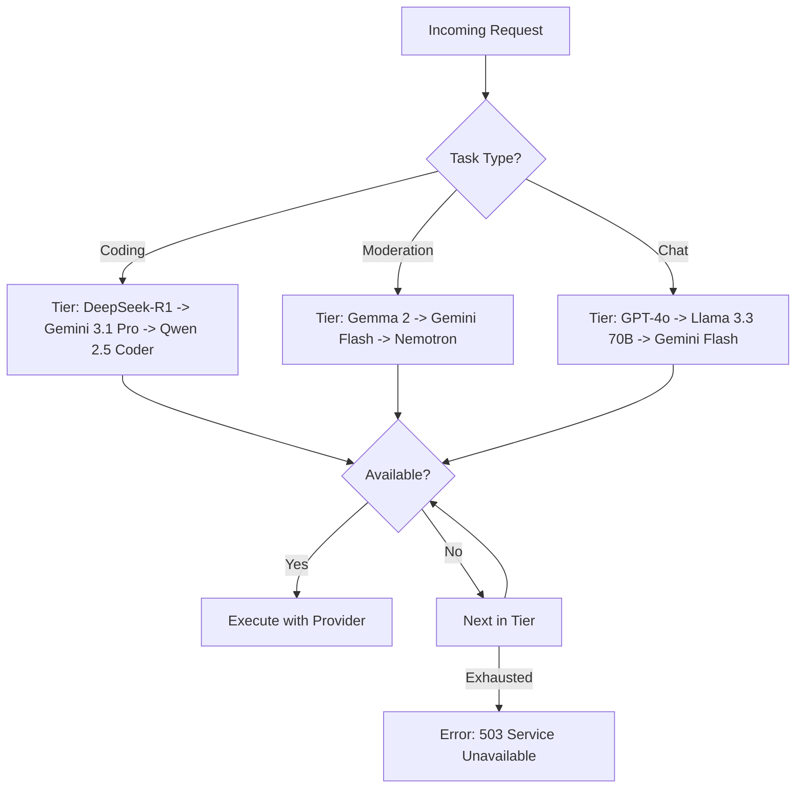
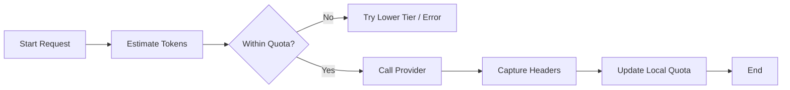
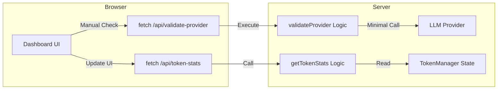

# Workflow & Architecture Guide

This guide explains the inner workings of the Intelligent LLM Orchestration Pipeline, including routing logic, token management, and middleware execution.

## 1. Orchestration Pipeline Flow

The system uses a Starlette-inspired middleware pipeline. Every request passes through a series of "layers" before reaching the LLM provider.

## 2. Intelligent Routing Logic

The `IntelligentRouterMiddleware` dynamically maps abstract tasks to a prioritized list of models. If the first choice is unavailable (e.g., missing API key or rate limited), it cascades to the next best option.

## 3. Token Management & Synchronization

The pipeline maintains a local "interpolated" token count to prevent overwhelming providers and hitting hard limits.

1.  **Local Estimation**: Before a request, `js-tiktoken` estimates the input tokens.
2.  **Proactive Blocking**: If the estimated usage exceeds the remaining quota, the request is blocked or routed elsewhere.
3.  **Response Sync**: After a successful call, the `TokenManagerMiddleware` reads `x-ratelimit-remaining-tokens` (and similar headers) to update the ground truth.

## 4. MCP Tools Interaction

The server exposes a suite of tools for LLM interaction, discovery, and system management.

### LLM Tools
- **`use_free_llm`**: The primary gateway to the orchestration pipeline. 
  - *Input*: `model`, `messages`, `task?` (coding, chat, etc.).
  - *Logic*: Automatically routes through the `PipelineExecutor`.
- **`list_available_free_models`**: Discover all supported models across all providers.
  - *Option*: `available_only: true` filters for providers with active API keys.

- **`run_code`**: Executes arbitrary JavaScript code in a sandboxed environment against data. The DATA variable contains the input data as a string. Use print() to output results.
  - *Input*: `code: string`, `data?: string`
  - *Logic*: Executes the code in a sandboxed environment and returns the output.

- **`manage_memory`**: Interface for the persistent, workspace-aware semantic memory system.
  - *Actions*: `search`, `list`, `stats`, `clear`.

### Monitoring & Validation
- **`get_token_stats`**: View real-time token tracking statistics and remaining limits for all loaded API providers. Used by the visual dashboard.
- **`validate_provider`**: Runs a live, professional health check for a specific provider to confirm credential validity and latency.

### System Tools
- **`code_mode`**: Executes arbitrary JavaScript code in a secure, sandboxed QuickJS environment. 
  - *Use Case*: Processing large data sets locally without sending everything to an LLM.
- **`manage_memory`**: Interface for the persistent, workspace-aware semantic memory system.
  - *Actions*: `search`, `list`, `stats`, `clear`.

## 5. Visual Dashboard & SSE Bridge

The server includes a Bootstrap 5 dashboard for real-time monitoring. 

To enable the dashboard, start the server using the `--sse` flag or `npm run dashboard`. This switches the transport from `stdio` to `SSEServerTransport` and exposes the API bridge on port 3000.

## 6. Professional Credential Validation

The system implements a multi-tier validation strategy to ensure high reliability:

1.  **Pattern Hardening**: `BaseProvider.isAvailable()` automatically filters out common placeholders (e.g., `your_github_token_here`) and extremely short keys.
2.  **Live Health Checks**: The `validate_provider` tool/API executes a real, minimal chat completion call with `max_tokens: 1`. This confirms that the key is not only present but also valid and authorized by the provider.
3.  **UI Feedback**: In the dashboard, each provider card features a **Verify Credential** button, allowing developers to immediately troubleshoot configuration issues without looking at server logs.
