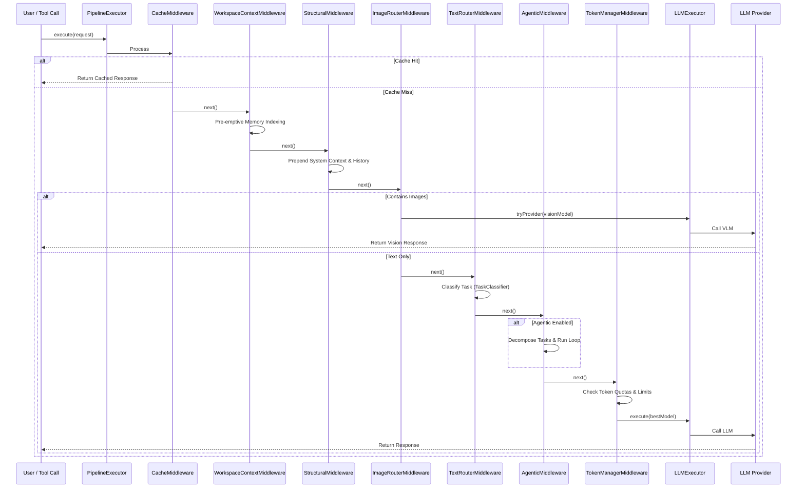

# Workflow & Architecture Guide

This guide explains the inner workings of the LLM Orchestration Pipeline, including routing logic, token management, and middleware execution.

---

## 1. Orchestration Pipeline Flow (v1.0.6 Update)

The system uses a middleware-based pipeline. Every request passes through a series of decoupled middleware layers before reaching the LLM provider.

### 🔄 Decoupled Pipeline Architecture

The pipeline consists of the following sequential layers:



### Pipeline Order (v1.0.6)
1. **`ResponseCacheMiddleware`**: Checks memory/disk cache for existing responses to save tokens.
2. **`WorkspaceContextMiddleware`**: Handles pre-emptive indexing and injects the 2-level directory tree.
3. **`StructuralMiddleware`**: Injects session history and grounding context (`knowledge.md`).
4. **`ImageRouterMiddleware`**: Intercepts base64/local image files and routes them to VLMs.
5. **`TextRouterMiddleware`**: Routes text prompts to the optimal model based on task type.
6. **`AgenticMiddleware`**: Handles task decomposition, subtask execution, and verification loops.
7. **`TokenManagerMiddleware`**: Enforces rate-limit tracking and quota gates.

---

## 2. Decoupled Routing & Classification

### Task-Based Model Mapping
The `TextRouterMiddleware` uses the centralized `TaskClassifier` to route the prompt to the optimal tier of models:

* **Coding**: `qwen/qwen3-coder-480b-a35b:free` -> `gemini-3.1-flash-lite`
* **Reasoning**: `DeepSeek-R1` -> `qwen/qwq-32b`
* **Search / Summarization**: `Qwen/Qwen2.5-72B-Instruct` -> `cohere/command-r-plus`
* **Chat / General**: `meta-llama/llama-3.3-70b-instruct`

### Centralized Task Classifier
The `TaskClassifier` uses single-pass regex heuristics with word boundaries (`\b`) and a keyword weighting map (`keywordTaskMap`) to classify the task type (e.g., `coding`, `reasoning`, `search`, `summarization`, `chat`) in under 0.05ms, preventing any overhead.

---

## 3. Token Management & Synchronization

The pipeline maintains a local "interpolated" token count to prevent overwhelming providers and hitting hard limits. Token management is handled by the `LLMExecutor` utility class, which is called directly by the router during fallback attempts.

### Token Management Flow
1. **Local Estimation**: Before a request, `js-tiktoken` estimates the input tokens.
2. **Proactive Blocking**: If the estimated usage exceeds the remaining quota, the request is blocked or routed elsewhere.
3. **Provider Execution**: `LLMExecutor.tryProvider()` combines token checks + API call in one atomic operation.
4. **Response Sync**: After a successful call, the executor reads `x-ratelimit-remaining-tokens` headers to update the ground truth.

---

## 4. MCP Tools Interaction

The server exposes public tools for LLM interaction, discovery, and workspace management:

### 1. `use_free_llm`
Universal chat interface with automatic fallback cascade through 70+ free models.

### 2. `execute_skill` [NEW]
Runs a prompt grounded in a specific skill's instructions. Resolves the skill directory, parses relative file paths in `SKILL.md` (e.g. `references/`, `resources/`), loads their contents, and injects them as system context.

### 3. `vision_tool` [NEW]
Processes local or remote image files, converting them to base64 and routing them to available vision providers.

### 4. `manage_memory`
Interface for the persistent, workspace-aware memory system.
- **Actions**: `search`, `list`, `stats`, `clear`.

### 5. `store_workspace_skill` & `index_workspace`
- **`store_workspace_skill`**: Explicitly save structured research and decisions following the `@skill-writer` schema.
- **`index_workspace`**: Proactively index all workspace files into the vector database for high-fidelity semantic recall.

---

## 5. Agentic Middleware & State Management

The optional **Agentic Middleware** (`src/pipeline/middlewares/AgenticMiddleware.ts`) adds a structured, self-improving execution layer on top of the existing pipeline.

### What it does

| Feature | Description |
|---------|-------------|
| **System Prompt Injection** | Prepends the tailored system prompt to every request, loaded dynamically via `getIntelligentSystemPrompt()`. |
| **Task Decomposition** | Splits the user goal into discrete steps and seeds the `nowQueue`. |
| **Momentum Queues** | In-memory `nowQueue`, `nextQueue`, `blockedQueue`, and `improveQueue` per session, persisted to `projects/{sessionId}/queues.json`. |
| **File-First State** | Creates `projects/{sessionId}/plan.md`, `tasks.md`, and `knowledge.md` on first use. |
| **Verification Loop** | After each step, performs a self-check LLM call. Failed verifications are enqueued to `improveQueue`. |

### Enabling the middleware
You can opt-in on a per-call basis by passing `"agentic": true` in the request body along with a **`workspace_root`** or **`sessionId`**.

---

## 🛠️ Developer Guide: Extending the Server

### 1. How to Add a New Middleware

Middlewares are executed sequentially by the `PipelineExecutor` registry. To add a new one:

#### Step A: Create the Middleware File
Create a new file under `src/pipeline/middlewares/MyCustomMiddleware.ts` implementing the `Middleware` interface:

```typescript
import { Middleware, PipelineContext, NextFunction } from '../middleware.js';

export class MyCustomMiddleware implements Middleware {
  async execute(context: PipelineContext, next: NextFunction): Promise<void> {
    // 1. Pre-execution logic (runs on the way down)
    console.log("Pre-execution check...");

    // 2. Pass control to the next middleware in the pipeline
    await next();

    // 3. Post-execution logic (runs on the way back up)
    console.log("Post-execution cleanup...");
  }
}
```

#### Step B: Register the Middleware in the Pipeline
Open [instances.ts](file:///c:/Users/mahes/OneDrive/Desktop/Python-Projects/awesome-free-llm-apis/mcp-server/src/pipeline/instances.ts) and add your new middleware instance to the `PipelineExecutor` array in the desired sequence:

```typescript
import { MyCustomMiddleware } from './middlewares/MyCustomMiddleware.js';

const executor = new PipelineExecutor([
  new ResponseCacheMiddleware(),
  new WorkspaceContextMiddleware(),
  new StructuralMiddleware(),
  new ImageRouterMiddleware(),
  new MyCustomMiddleware(), // <-- Injected here
  new TextRouterMiddleware(),
  new AgenticMiddleware(),
  new TokenManagerMiddleware()
]);
```

---

### 2. How to Add a New LLM Provider

To add support for a new free provider in under 20 lines of code:

#### Step A: Create the Provider Class
Create a new file under `src/providers/my-provider.ts` inheriting from `BaseProvider`:

```typescript
import { BaseProvider } from './base.js';

export class MyProvider extends BaseProvider {
  name = 'My Free AI';
  id = 'my-free-ai';
  baseURL = 'https://api.myfreeai.com/v1/';
  envVar = 'MY_FREE_AI_API_KEY'; // Env variable containing the API key
  
  models = [
    { id: 'my-model-70b', name: 'My Model 70B', contextWindow: 32768 },
    { id: 'my-vision-model', name: 'My Vision Model', contextWindow: 16384, isVision: true }
  ];

  rateLimits = {
    rpm: 15,    // Requests per minute
    rpd: 1000,  // Requests per day
    tpm: 50000  // Tokens per minute (optional)
  };
}
```

#### Step B: Register in the Provider Registry
Open [registry.ts](file:///c:/Users/mahes/OneDrive/Desktop/Python-Projects/awesome-free-llm-apis/mcp-server/src/providers/registry.ts), import your new provider class, and push it to the `allProviders` array in the constructor:

```typescript
import { MyProvider } from './my-provider.js';

// Inside ProviderRegistry constructor:
this.allProviders.push(new MyProvider());
```

The server's fallback routing, token interpolation, header synchronization, and diagnostic validation tools will now automatically pick up and manage your new provider!
