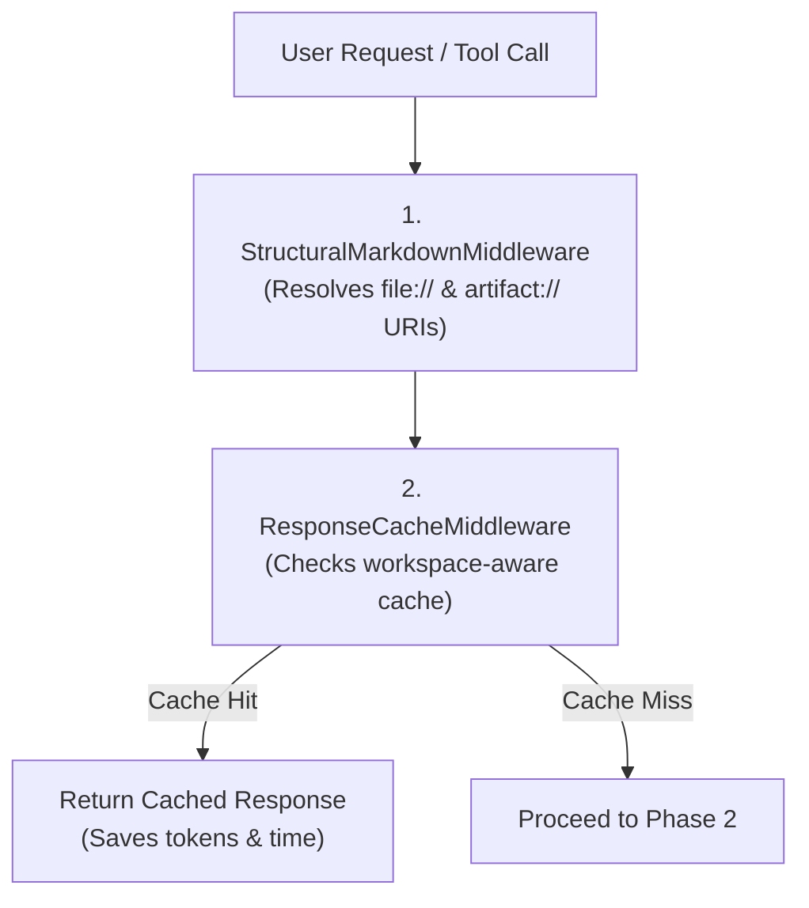
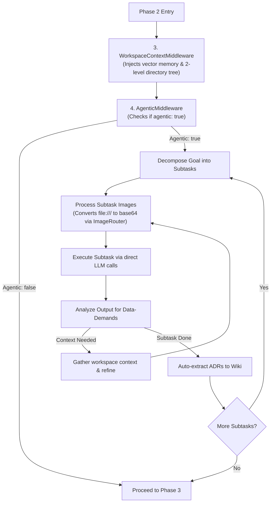
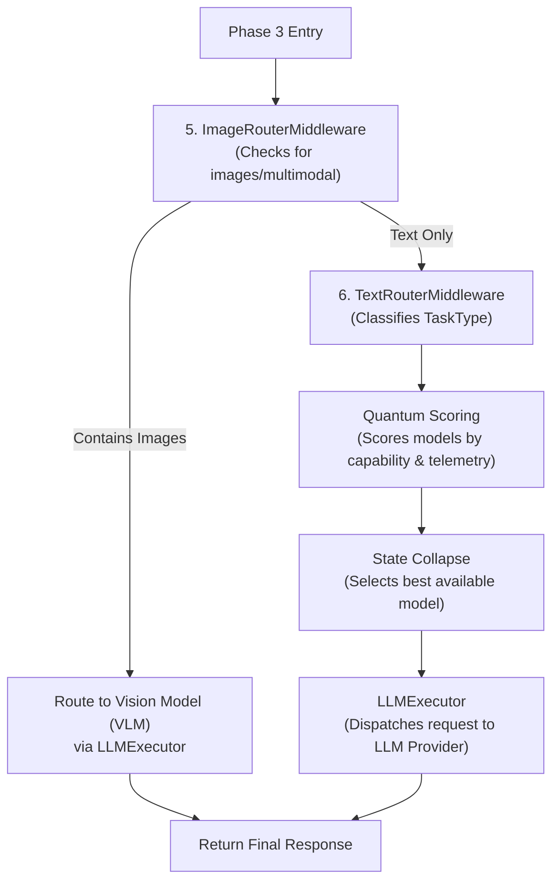

# Workflow & Architecture Guide

This guide explains the inner workings of the LLM Orchestration Pipeline, including routing logic, token management, and middleware execution.

---

## 1. Orchestration Pipeline Flow (v1.0.6 Update)

The system uses a middleware-based pipeline. Every request passes through a series of decoupled middleware layers before reaching the LLM provider.

### 🔄 Decoupled Pipeline Architecture (Phased Breakdown)
 
To make the pipeline execution easy to understand, it is broken down into three distinct phases:
 
#### Phase 1: Request & Cache Checking
In this phase, the server sanitizes the request and attempts to serve it from the local cache.
 

 
#### Phase 2: Context Gathering & Agentic Planning
If the cache misses, the server gathers workspace context and, if enabled, runs the agentic subtask execution loop.
 

 
* **Subtask Visual Grounding**: To support visual TDD, if a subtask prompt references local images or artifacts (e.g. `file:///path/to/screenshot.png`), `AgenticMiddleware` automatically invokes `ImageRouterMiddleware`'s processing engine to convert the URLs to base64 before calling the LLM executor.
* **Vision Model Prioritization**: When executing an image-bearing subtask, `LLMExecutor` automatically detects the image payload and **prioritizes vision-capable models** (such as `gemini-3.1-flash-lite` or `google/gemma-4-31b-it:free`) to prevent routing failures to text-only models.
 
---
 
#### Phase 3: Routing & LLM Execution
Finally, the request is routed depending on whether it contains images, scored using the quantum router, and dispatched to the LLM.
 

### Pipeline Order (v1.0.6)
1. **`StructuralMarkdownMiddleware`**: Resolves `file://` and `artifact://` URIs with security boundary checks.
2. **`ResponseCacheMiddleware`**: Checks if a result exists in the persistent workspace-aware cache.
3. **`WorkspaceContextMiddleware`**: Injects vector-searched memory, grep context, and intelligent system prompts.
4. **`AgenticMiddleware`**: Decomposes tasks into subtasks and manages the subtask execution and retrospection loop.
5. **`ImageRouterMiddleware`**: Intercepts base64/local image files and routes them to VLMs.
6. **`TextRouterMiddleware`**: Routes text prompts to the optimal model based on task type.

---

## 2. Quantum-Inspired Routing & Model Scoring

The `TextRouterMiddleware` uses a **probabilistic quantum scoring matrix** instead of static model routing. It treats model selection as a state vector that collapses based on real-time telemetry and task constraints.

### Task-Based Model Mapping
The centralized `TaskClassifier` dynamically classifies the request into a `TaskType` and collapses the routing state to the optimal model tier:

* **Coding**: `qwen/qwen3-coder-480b-a35b:free` -> `gemini-3.1-flash-lite`
* **Reasoning**: `deepseek/deepseek-r1` -> `nvidia/nemotron-3-ultra-550b-a55b`
* **Search / Summarization**: `gemini-3.1-flash-lite` -> `cohere/command-r-plus`
* **Chat / General**: `meta-llama/llama-3.3-70b-instruct`

### State Collapse & Telemetry
1. **Scoring**: Each model is scored based on the classified `TaskType`.
2. **Modifiers**: Real-time RPM/RPD quotas and latency averages (from `get_token_stats`) modify the scores.
3. **Collapse**: The system sorts models by collapse probability and sequentially attempts execution, falling back instantly if a provider fails.

### Centralized Task Classifier
The `TaskClassifier` uses single-pass regex heuristics with word boundaries (`\b`) and a keyword weighting map (`keywordTaskMap`) to classify the task type in under 0.05ms, preventing any overhead.ad.

---

## 3. Token Management & Synchronization

The pipeline maintains a local "interpolated" token count to prevent overwhelming providers and hitting hard limits. Token management is handled by the `LLMExecutor` utility class, which is called directly by the router during fallback attempts.

### Token Management Flow
1. **Local Estimation**: Before a request, `js-tiktoken` estimates the input tokens.
2. **Proactive Blocking**: If the estimated usage exceeds the remaining quota, the request is blocked or routed elsewhere.
3. **Provider Execution**: `LLMExecutor.tryProvider()` combines token checks + API call in one atomic operation.
4. **Response Sync**: After a successful call, the executor reads `x-ratelimit-remaining-tokens` headers to update the ground truth.

---

## 4. MCP Tools Interaction

The server exposes public tools for LLM interaction, discovery, and workspace management:

### 1. `use_free_llm`
Universal chat interface with automatic fallback cascade through 70+ free models.

### 2. `execute_skill` [NEW]
Runs a prompt grounded in a specific skill's instructions. Resolves the skill directory, parses relative file paths in `SKILL.md` (e.g. `references/`, `resources/`), loads their contents, and injects them as system context.

### 3. `vision_tool` [NEW]
Processes local or remote image files, converting them to base64 and routing them to available vision providers.

### 4. `manage_memory`
Interface for the persistent, workspace-aware memory system.
- **Actions**: `search`, `list`, `stats`, `clear`.

### 5. `store_workspace_skill` & `index_workspace`
- **`store_workspace_skill`**: Explicitly save structured research and decisions following the `@skill-writer` schema.
- **`index_workspace`**: Proactively index all workspace files into the vector database for high-fidelity semantic recall.

---

## 5. Agentic Middleware & State Management

The optional **Agentic Middleware** (`src/pipeline/middlewares/AgenticMiddleware.ts`) adds a structured, self-improving execution layer on top of the existing pipeline.

### What it does

| Feature | Description |
|---------|-------------|
| **System Prompt Injection** | Prepends the tailored system prompt to every request, loaded dynamically via `getIntelligentSystemPrompt()`. |
| **Task Decomposition** | Splits the user goal into discrete steps and seeds the `nowQueue`. |
| **Momentum Queues** | In-memory `nowQueue`, `nextQueue`, `blockedQueue`, and `improveQueue` per session, persisted to `projects/{sessionId}/queues.json`. |
| **File-First State** | Creates `projects/{sessionId}/plan.md`, `tasks.md`, and `knowledge.md` on first use. |
| **Verification Loop** | After each step, performs a self-check LLM call. Failed verifications are enqueued to `improveQueue`. |

### Enabling the middleware
You can opt-in on a per-call basis by passing `"agentic": true` in the request body along with a **`workspace_root`** or **`sessionId`**.

## 6. Firebase for debugging and telemetry

The firebase integration is used for telemetry and debugging purposes. It collects anonymized usage data, error logs, and performance metrics to help improve the system. You can view the collected data in the Firebase console. 

You can disable Firebase telemetry by setting `FIREBASE_API_KEY` to an empty string in the `.env` file. The server will then skip telemetry initialization and logging. 
