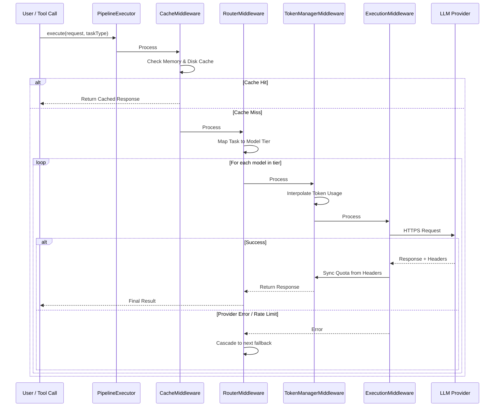
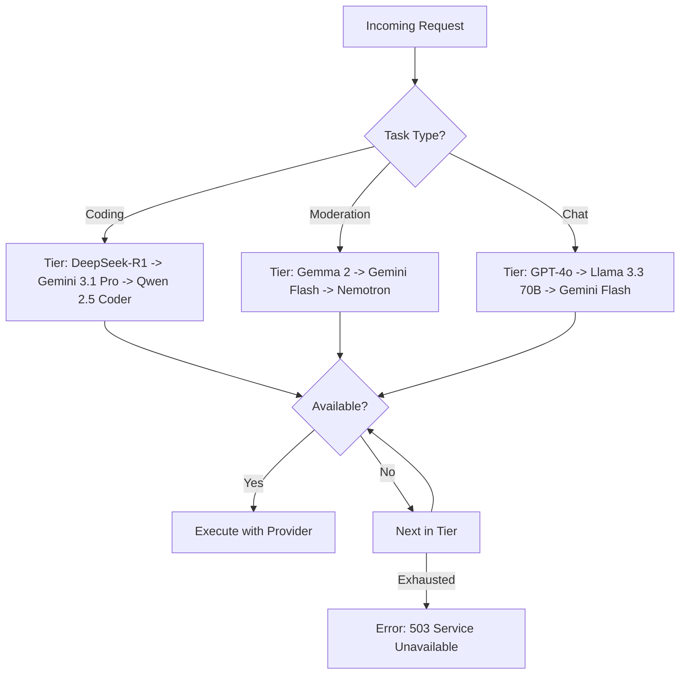
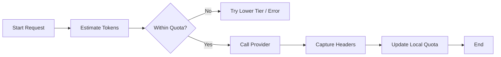
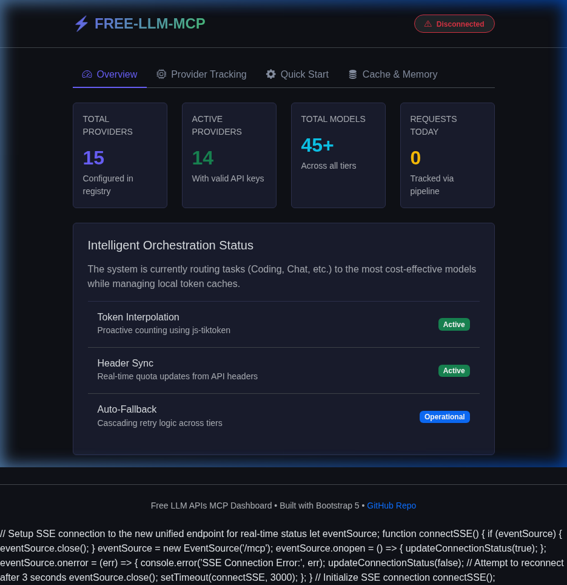
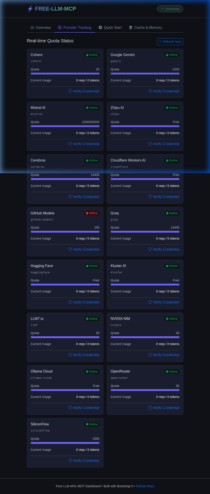
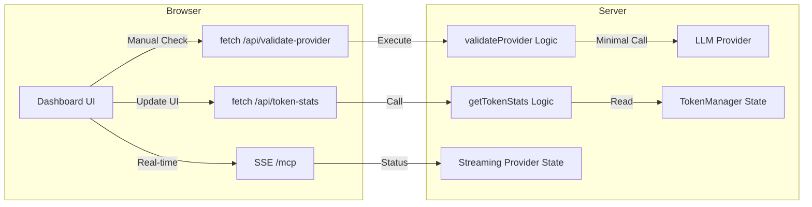

# Workflow & Architecture Guide

This guide explains the inner workings of the LLM Orchestration Pipeline, including routing logic, token management, and middleware execution.

## 1. Orchestration Pipeline Flow

The system uses a middleware-based pipeline. Every request passes through a series of "layers" before reaching the LLM provider.



## 2. Intelligent Routing Logic

The `IntelligentRouterMiddleware` dynamically maps abstract tasks to a prioritized list of models. If the first choice is unavailable (e.g., missing API key or rate limited), it cascades to the next best option.



## 3. Token Management & Synchronization

The pipeline maintains a local "interpolated" token count to prevent overwhelming providers and hitting hard limits.

1.  **Local Estimation**: Before a request, `js-tiktoken` estimates the input tokens.
2.  **Proactive Blocking**: If the estimated usage exceeds the remaining quota, the request is blocked or routed elsewhere.
3.  **Response Sync**: After a successful call, the `TokenManagerMiddleware` reads `x-ratelimit-remaining-tokens` (and similar headers) to update the ground truth.



## 4. MCP Tools Interaction

The server exposes a suite of tools for LLM interaction, discovery, and system management.

### Tool Discovery Handshake
The system follows the standard MCP lifecycle:
1.  **Initialize**: Client connects and receives capabilities. Note that `capabilities.tools` returns an empty object `{}` per spec to signal support.
2.  **List Tools**: Client calls `tools/list` to receive the full JSON schema for all available tools.

### 1. `use_free_llm`
The primary gateway to the orchestration pipeline. 

| Parameter | Type | Required | Description |
|-----------|------|----------|-------------|
| `model` | string | Yes | The model ID (e.g., `gpt-4o`, `gemini-1.5-pro`). |
| `messages` | array | Yes | Array of role/content message objects. |
| `task` | string | No | Abstract task hint (`coding`, `chat`, `moderation`). |
| `temperature`| number | No | Sampling temperature (0.0 - 1.0). |
| `max_tokens` | number | No | Maximum tokens to generate. |
| `workspace_root`| string | No | Path to scan for local context. |

### 2. `list_available_free_models`
Discover all supported models across all providers.
- **Param**: `available_only: true` filters for providers with active API keys.

### 3. `manage_memory`
Interface for the persistent, workspace-aware semantic memory system.
- **Actions**: `search`, `list`, `stats`, `clear`.
- **Note on Architecture**: All memory is physically stored centrally in the MCP server's local `data/memory.json` file. The `workspace_root` parameter is used to generate a unique cryptographic hash, which acts as a **logical namespace** to safely isolate context between different projects.

### 4. `code_mode`
Executes arbitrary JavaScript code in a secure, sandboxed QuickJS environment. 
- **Use Case**: Processing large data sets locally without sending sensitive raw data to an LLM.

### 5. `get_token_stats` & `validate_provider`
Utility tools for monitoring system health and verifying credentials.

## 5. Visual Dashboard & SSE Bridge

The server includes a Bootstrap 5 dashboard for real-time monitoring. By default, it runs on port 3000 when starting via `npm run dashboard`.

### 5.1 Dashboard Overview
The main landing page provides high-level statistics about the orchestration health, including total providers configured, active credentials, and the currently operational automation status (Token Interpolation, Header Sync, and Auto-Fallback).



### 5.2 Provider Tracking
The Provider Tracking tab offers a granular look at every configured LLM backend. It shows real-time quota status, current token/request usage, and provides a **Verify Credential** diagnostic tool to check connectivity and API key validity instantly.



### 5.3 Communication Architecture


To enable the dashboard and remote MCP access, start the server using the `--sse` flag or `npm run dashboard`. This switches the transport from `stdio` to `StreamableHTTPServerTransport` and exposes the unified `/mcp` endpoint and API bridge on port 3000.

## 6. Professional Credential Validation

The system implements a multi-tier validation strategy to ensure high reliability:

1.  **Pattern Hardening**: `BaseProvider.isAvailable()` automatically filters out common placeholders (e.g., `your_github_token_here`) and extremely short keys.
2.  **Live Health Checks**: The `validate_provider` tool/API executes a real, minimal chat completion call with `max_tokens: 1`. This confirms that the key is not only present but also valid and authorized by the provider.
3.  **UI Feedback**: In the dashboard, each provider card features a **Verify Credential** button, allowing developers to immediately troubleshoot configuration issues without looking at server logs.

## 7. Security & Networking Architecture

When the server runs in HTTP/SSE mode (e.g., via `--sse` or `npm run dashboard`), it leverages robust web security practices to protect the MCP integration and dashboard:

1.  **Strict CORS Policy**: `cors()` middleware ensures that cross-origin requests are appropriately managed, preventing unauthorized domains from interacting with the `/mcp` or API endpoints.
2.  **Helmet Integration**: The extensive `helmet()` middleware provides multiple layers of defense:
    *   **Content Security Policy (CSP)**: Restricts scripts and styles to `'self'` and explicitly trusted CDNs (like `https://cdn.jsdelivr.net`), mitigating XSS risks.
    *   **HTTP Strict Transport Security (HSTS)**: Forces clients to interact over secure channels, with `includeSubDomains: true` and `preload: true`.
    *   It also automatically strips vulnerable headers (like `X-Powered-By`) and configures `X-Frame-Options` and strict MIME sniffing.

## 8. Agentic Middleware v2

The optional **Agentic Middleware** (`src/middleware/agentic/`) adds a structured, self-improving execution layer on top of the existing pipeline.

### What it does

| Feature | Description |
|---------|-------------|
| **System Prompt Injection** | Prepends the tailored system prompt to every request, loaded dynamically via `getIntelligentSystemPrompt()`. |
| **Task Decomposition** | Splits the user goal into discrete steps and seeds the `nowQueue`. |
| **Momentum Queues** | In-memory `nowQueue`, `nextQueue`, `blockedQueue`, and `improveQueue` per session, persisted to `projects/{sessionId}/queues.json`. |
| **File-First State** | Creates `projects/{sessionId}/plan.md`, `tasks.md`, and `knowledge.md` on first use. |
| **Verification Loop** | After each step, performs a self-check LLM call. Failed verifications are enqueued to `improveQueue`. |

### How it uses the external prompt

The prompt loader (`src/middleware/agentic/prompts.ts`) resolves the system prompt asynchronously on its first use and memoizes the result:

1. Checks `external/agent-prompt/prompt.json` (Tier 1: Pre-computed, optimized).
2. Falls back to `external/agent-prompt/README.md` (Tier 2: Raw Markdown).
3. Uses a hardcoded default (Tier 4) if all external sources are unavailable.

The async function `getIntelligentSystemPrompt()` is used to ensure non-blocking server initialization. Subsequent calls are served from an in-memory cache.

### Enabling the middleware

The Agentic Middleware supports a **Dual-Mode Trigger** for both global automation and selective opt-in:

#### 1. Global Mode (`.env`)
Set the environment variable to enable the agentic layer for **all** requests. If a `sessionId` is missing, one will be auto-generated (e.g., `temp-{timestamp}`).

```sh
ENABLE_AGENTIC_MIDDLEWARE=true npm run dev
```

#### 2. Selective Mode (Per-Request)
You can opt-in on a per-call basis by passing `"agentic": true` in the request body. In this mode, providing a **`sessionId` is mandatory**.

| Trigger | `ENABLE_AGENTIC_MIDDLEWARE` | `request.agentic` | `sessionId` |
|:---|:---|:---|:---|
| **Global** | `true` | (Any) | Optional (Auto-gen) |
| **Opt-In** | `false` / Unset | `true` | **Mandatory** |
| **Off** | `false` / Unset | `false` | N/A |

Without either trigger, the middleware is a transparent pass-through with zero overhead.

### Example flow

```
User: "Build a REST API with auth and tests"
  │
  ▼
AgenticMiddleware.execute()
  ├─ Await prependSystemPrompt(messages) (Dynamic/Async)
  ├─ Decompose goal → steps ["Build REST API", "Add auth", "Write tests"]
  ├─ nowQueue = ["Build REST API", "Add auth", "Write tests"]
  ├─ Persist queues.json + ensure plan.md / tasks.md / knowledge.md
  ├─ Call next() → existing pipeline (Cache → Router → Token → LLM)
  ├─ Verification: self-check response via second LLM call
  │    ├─ PASS → continue
  │    └─ FAIL → push reason to improveQueue
  └─ Shift nowQueue, persist state
```

