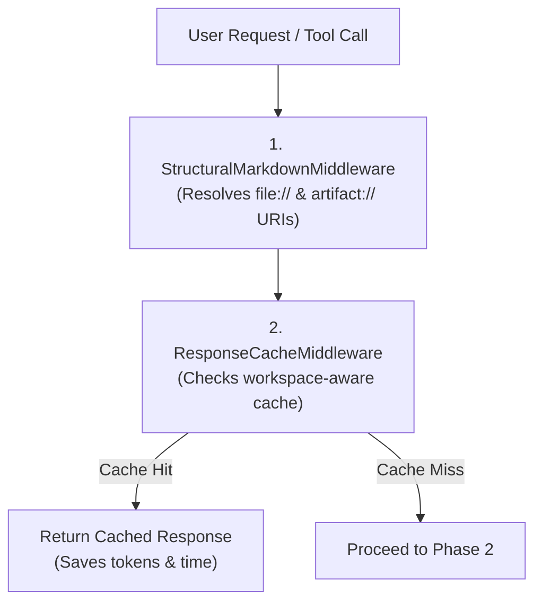
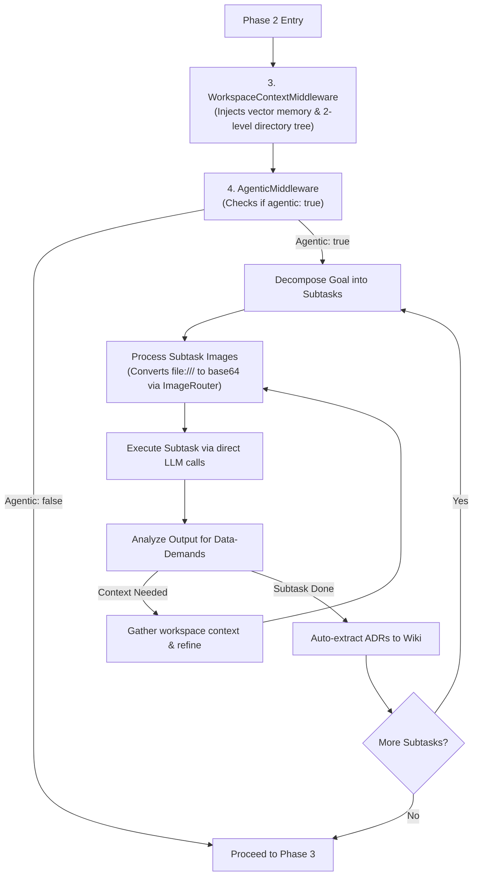
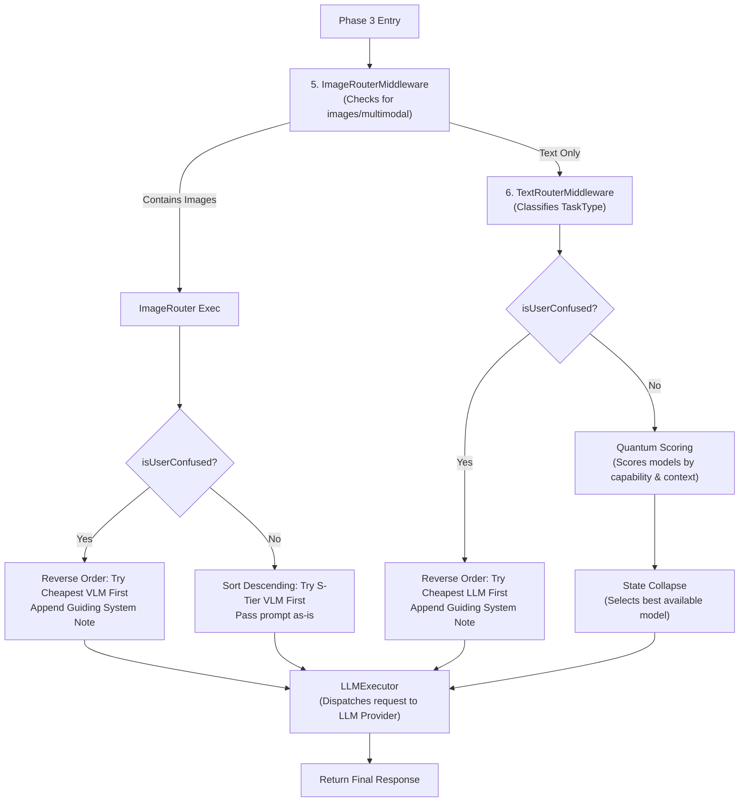
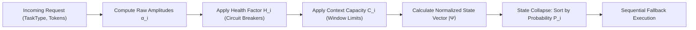
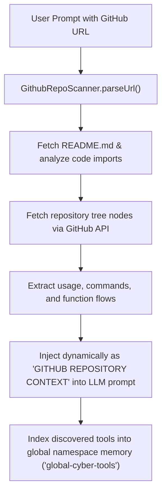
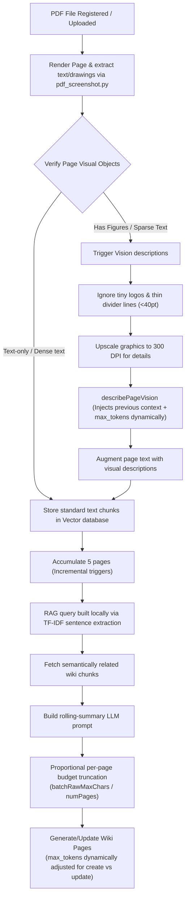
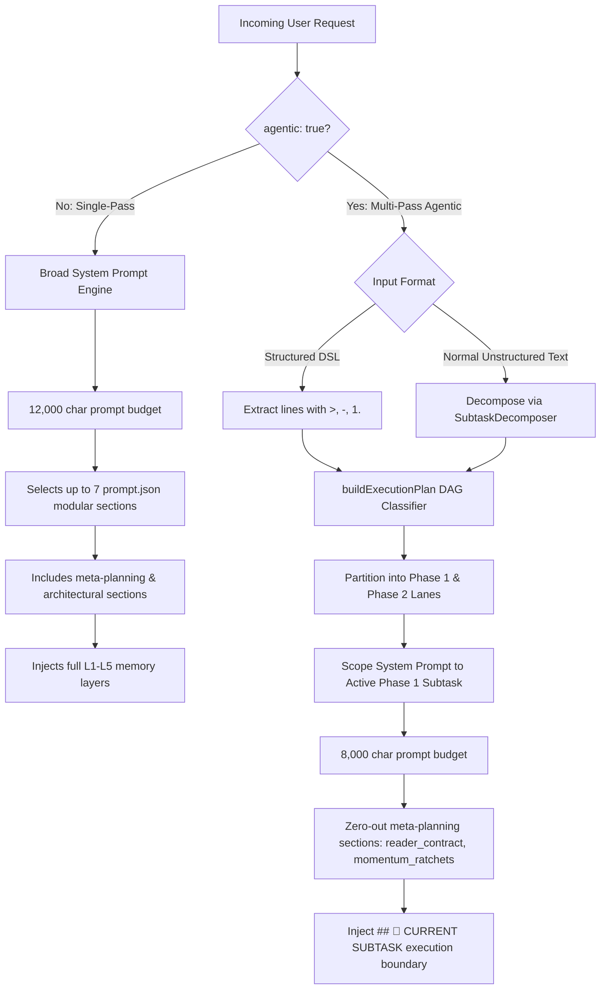

# Workflow & Architecture Guide

This guide explains the inner workings of the LLM Orchestration Pipeline, including routing logic, token management, and middleware execution.

---

## 1. Orchestration Pipeline Flow (v1.0.6 Update)

The system uses a middleware-based pipeline. Every request passes through a series of decoupled middleware layers before reaching the LLM provider.

### 🔄 Decoupled Pipeline Architecture (Phased Breakdown)
 
To make the pipeline execution easy to understand, it is broken down into three distinct phases:
 
#### Phase 1: Request & Cache Checking
In this phase, the server sanitizes the request and attempts to serve it from the local cache.
 

```mermaid
graph TD
    A["User Request / Tool Call"] --> B["1. StructuralMarkdownMiddleware<br/>(Resolves file:// & artifact:// URIs)"]
    B --> C["2. ResponseCacheMiddleware<br/>(Checks workspace-aware cache)"]
    C -->|Cache Hit| D["Return Cached Response<br/>(Saves tokens & time)"]
    C -->|Cache Miss| E["Proceed to Phase 2"]
```
 
#### Phase 2: Context Gathering & Agentic Planning
If the cache misses, the server gathers workspace context and, if enabled, runs the agentic subtask execution loop.
 

```mermaid
graph TD
    A["Phase 2 Entry"] --> B["3. WorkspaceContextMiddleware<br/>(Injects vector memory & 2-level directory tree)"]
    B --> C["4. AgenticMiddleware<br/>(Checks if agentic: true)"]
    C -->|Agentic: false| D["Proceed to Phase 3"]
    C -->|Agentic: true| E["Decompose Goal into Subtasks"]
    E --> F["Process Subtask Images<br/>(Converts file:/// to base64 via ImageRouter)"]
    F --> G["Execute Subtask via direct LLM calls"]
    G --> H["Analyze Output for Data-Demands"]
    H -->|Context Needed| I["Gather workspace context & refine"]
    I --> F
    H -->|Subtask Done| J["Auto-extract ADRs to Wiki"]
    J --> K{"More Subtasks?"}
    K -->|Yes| E
    K -->|No| D
```
 
* **Subtask Visual Grounding**: To support visual TDD, if a subtask prompt references local images or artifacts (e.g. `file:///path/to/screenshot.png`), `AgenticMiddleware` automatically invokes `ImageRouterMiddleware`'s processing engine to convert the URLs to base64 before calling the LLM executor.
* **Vision Model Prioritization**: When executing an image-bearing subtask, `LLMExecutor` automatically detects the image payload and **prioritizes vision-capable models** (such as `gemini-3.1-flash-lite` or `google/gemma-4-31b-it:free`) to prevent routing failures to text-only models.
 
---
 
#### Phase 3: Routing & LLM Execution
Finally, the request is routed depending on whether it contains images, scored using the quantum router, and dispatched to the LLM. If a confused user state is detected, fallback trial ordering is reversed and a guiding system note is appended — this no longer affects indexing (see note below).
 

```mermaid
graph TD
    A["Phase 3 Entry"] --> B["5. ImageRouterMiddleware<br/>(Checks for images/multimodal)"]
    B -->|Contains Images| C["ImageRouter Exec"]
    C --> D{isUserConfused?}
    D -->|Yes| E["Reverse Order: Try Cheapest VLM First<br/>Append Guiding System Note"]
    D -->|No| F["Sort Descending: Try S-Tier VLM First<br/>Pass prompt as-is"]
    B -->|Text Only| G["6. TextRouterMiddleware<br/>(Classifies TaskType)"]
    G --> H{isUserConfused?}
    H -->|Yes| I["Reverse Order: Try Cheapest LLM First<br/>Append Guiding System Note"]
    H -->|No| J["Quantum Scoring<br/>(Scores models by capability & context)"]
    J --> K["State Collapse<br/>(Selects best available model)"]
    E --> L["LLMExecutor<br/>(Dispatches request to LLM Provider)"]
    F --> L
    I --> L
    K --> L
    L --> M["Return Final Response"]
```

### Pipeline Order (v1.0.7 Update)
1. **`StructuralMarkdownMiddleware`**: Resolves `file://` and `artifact://` URIs with security boundary checks.
2. **`ResponseCacheMiddleware`**: Checks if a result exists in the persistent workspace-aware cache.
3. **`WorkspaceContextMiddleware`**: Injects vector-searched memory and system prompts. Backgrounds (via `setImmediate`, non-blocking) a pre-emptive workspace re-index followed by wiki maintenance, gated on `agentic: true` + a `workspace_root`. **Bypassed only if the caller sets `skipIndexing: true` on the request itself** — see note below.
4. **`AgenticMiddleware`**: Decomposes tasks into subtasks and manages execution loops.
5. **`ImageRouterMiddleware`**: Intercepts local/remote image files, checks for confused/empty prompts (image-only), reverses model trial order to save token budget, and appends a guiding system note.
6. **`TextRouterMiddleware`**: Routes text prompts. Reverses model trial order and appends a guiding system note for file-only/generic confused queries.

> [!NOTE]
> **`skipIndexing` is caller-set only.** `WorkspaceContextMiddleware` runs *before* `AgenticMiddleware`/`ImageRouterMiddleware`/`TextRouterMiddleware` in the pipeline and reads `skipIndexing` before calling `next()`, so none of those downstream middlewares can set it in time to have any effect — it must already be `true` on the incoming request (see `use_free_llm`'s `skipIndexing` parameter in `SKILL.md`). Earlier versions had the confused-user branches in `ImageRouterMiddleware`/`TextRouterMiddleware` also set this flag; that was dead code (set too late to matter) and was removed. PDF/image content reaching the workspace wiki is unaffected either way — see §8, which runs independently of this gate.

---

## 2. Quantum Scoring & Probabilistic Model Selection Mechanism

The `TextRouterMiddleware` uses a **probabilistic quantum scoring matrix** instead of static model routing. It models all eligible candidate models as a normalized state vector $|\Psi\rangle$ that collapses onto the optimal available model based on task alignment, provider health, token context capacity, and real-time rate limits.


```mermaid
flowchart LR
    A["Incoming Request (TaskType, Tokens)"] --> B["Compute Raw Amplitudes α_i"]
    B --> C["Apply Health Factor H_i (Circuit Breakers)"]
    C --> D["Apply Context Capacity C_i (Window Limits)"]
    D --> E["Calculate Normalized State Vector |Ψ⟩"]
    E --> F["State Collapse: Sort by Probability P_i"]
    F --> G["Sequential Fallback Execution"]
```

### 🎯 Task-Based Model Mapping
The centralized `TaskClassifier` dynamically classifies the request into a `TaskType` and collapses the routing state to the optimal model tier:
* **Coding**: `qwen/qwen3-coder-480b-a35b:free` &rarr; `gemini-3.1-flash-lite` &rarr; `codestral-latest`
* **Reasoning**: `deepseek/deepseek-r1` &rarr; `nvidia/nemotron-3-ultra-550b-a55b` &rarr; `z-ai/glm-5.2`
* **Search / Summarization**: `gemini-3.1-flash-lite` &rarr; `cohere/command-r-plus` &rarr; `mistral-small-latest`
* **Vision / Multimodal**: `qwen/qwen3.6-27b` &rarr; `meta/llama-3.2-90b-vision-instruct` &rarr; `gemini-3.1-flash-lite`
* **Chat / General**: `meta-llama/llama-3.3-70b-instruct` &rarr; `gemma4:31b`

### ⚡ State Collapse & Telemetry Lifecycle
1. **Scoring**: Each model is assigned an initial capability amplitude based on the classified `TaskType`.
2. **Modifiers**: Real-time RPM/RPD quotas, context window boundaries, and latency averages (from `get_token_stats`) scale the amplitudes.
3. **Collapse**: The system sorts models by collapse probability and sequentially attempts execution, falling back instantly if a provider fails or hits a rate limit.

### 🧠 Centralized Task Classifier
The `TaskClassifier` uses single-pass regex heuristics with word boundaries (`\b`) and a keyword weighting map (`keywordTaskMap`) to classify the task type in under 0.05ms, preventing any runtime latency overhead.

---

### 🧮 The State Vector Probability Equation

For a set of $N$ candidate models $\{M_1, M_2, \dots, M_N\}$, the quantum state vector is defined as:

$$|\Psi\rangle = \sum_{i=1}^{N} \alpha_i |M_i\rangle$$

Where the unnormalized amplitude $\alpha_i$ for model $M_i$ is given by:

$$\alpha_i = \text{Alignment}(M_i, \text{TaskType}) \times \text{HealthFactor}(M_i) \times \text{CapacityFactor}(M_i)$$

The normalized probability $P(M_i)$ of collapsing to model $M_i$ is:

$$P(M_i) = \frac{\alpha_i}{\sum_{j=1}^{N} \alpha_j}$$

---

### 🔬 Amplitude Weighting Parameters

#### 1. Task Alignment Factor
Calculated from the base model capability score ($\text{Cap} \in [0.5, 1.0]$) and specialized model architecture tags:
- **Coding Task**: $\text{Cap} \times 2.0$ (if specialized coder model), $\text{Cap} \times 1.5$ (if reasoning model), $\text{Cap} \times 0.8$ (general).
- **Reasoning Task**: $\text{Cap} \times 2.5$ (if deepseek-r1 / o1 / reasoning model), $\text{Cap} \times 0.6$ (general).
- **Vision Task**: $\text{Cap} \times 2.0$ (if VLM / multimodal), $0.01$ (if text-only).
- **Summarization Task**: $\text{Cap} \times 1.2$.

#### 2. Provider Health Factor ($\text{HealthFactor}$)
Tracks circuit breaker statuses across all active providers exposing model $M_i$:

$$\text{HealthFactor} = \frac{\text{Active Healthy Providers for } M_i}{\text{Total Providers for } M_i}$$

If all providers for $M_i$ are cooling down or hitting rate limits, $\text{HealthFactor}$ drops to $0.1$, safely deprioritizing the model without removing it from fallback options.

#### 3. Context Capacity Factor ($\text{CapacityFactor}$)
Prevents context truncation errors by checking the estimated input tokens against the model's physical context window ($W$):
- If $\text{Tokens} > 0.90 \times W \implies \text{CapacityFactor} = 0.1$
- If $\text{Tokens} > 0.70 \times W \implies \text{CapacityFactor} = 0.5$
- If $\text{Tokens} > 8,000$ and $\text{Cap} < 0.70 \implies \text{CapacityFactor} \times= 0.3$ (protects weak $<8\text{B}$ models from context bloat).

---

### 📉 Confused-User Inversion
When the `TaskClassifier` detects a confused user state (e.g. empty prompt or naked file upload without clear instructions), the sorting order is deliberately **inverted**:
- The router selects the cheapest / highest-throughput model first (e.g. `gemini-3.1-flash-lite`) to ask for clarification, conserving expensive reasoning quotas.
- Automatically appends a `[System Note: Guide the user]` prompt modifier.

---

## 3. Token Management & Synchronization

The pipeline maintains a local "interpolated" token count to prevent overwhelming providers and hitting hard limits. Token management is handled by the `LLMExecutor` utility class, which is called directly by the router during fallback attempts.

### Token Management Flow
1. **Local Estimation**: Before a request, `js-tiktoken` estimates the input tokens.
2. **Proactive Blocking**: If the estimated usage exceeds the remaining quota, the request is blocked or routed elsewhere.
3. **Provider Execution**: `LLMExecutor.tryProvider()` combines token checks + API call in one atomic operation.
4. **Response Sync**: After a successful call, the executor reads `x-ratelimit-remaining-tokens` headers to update the ground truth.

---

## 4. MCP Tools Interaction

The server exposes public tools for LLM interaction, discovery, and workspace management:

### 1. `use_free_llm`
Universal chat interface with automatic fallback cascade through 70+ free models.

### 2. `execute_skill` [NEW]
Runs a prompt grounded in a specific skill's instructions. Resolves the skill directory, parses relative file paths in `SKILL.md` (e.g. `references/`, `resources/`), loads their contents, and injects them as system context.

### 3. `vision_tool` [NEW]
Processes local or remote image files, converting them to base64 and routing them to available vision providers.

### 4. `manage_memory`
Interface for the persistent, workspace-aware memory system.
- **Actions**: `search`, `list`, `stats`, `clear`.

### 5. `store_workspace_skill` & `index_workspace`
- **`store_workspace_skill`**: Explicitly save structured research and decisions following the `@skill-writer` schema.
- **`index_workspace`**: Proactively index all workspace files into the vector database for high-fidelity semantic recall.

### 6. `local_llm_patch` [NEW]
Single-file code patching tool using a locally running Ollama instance. Ranks local coding models, enriches the prompt with neighborhood context, and returns a clean replacement patch without mutating disk.

### 7. `coding_agents` [NEW]
OMP-pattern (`oh-my-pi`) autonomous multi-file refactoring engine:
- **VectorStore TF-IDF RAG**: Discovers top candidate files matching the user's goal.
- **`[PATH#SHA8]` Snapshot Anchors**: Protects against concurrent multi-agent edits and drift.
- **Polyglot LSP & Subprocess Diagnostics**: Verifies code with `ts-morph` (TS/JS), Python `ast.parse`, Go `go vet`, and Rust `rustc --error-format json`.
- **Zero-Waste CAS Checkpointing**: Snapshots pre-apply states in a content-addressable store for instant rollback (`resolve: { action: 'rollback' }`).
- **Atomic Batch Commits**: Applies changes across multiple files transactionally on `resolve: { action: 'apply' }`.

See [skill/references/coding_agents.md](skill/references/coding_agents.md) for the complete reference and usage guide.

---

## 5. Agentic Middleware & State Management

The optional **Agentic Middleware** (`src/pipeline/middlewares/AgenticMiddleware.ts`) adds a structured, self-improving execution layer on top of the existing pipeline.

### Relevance of the `agentic` Flag
*   **`agentic: false` (One-Pass, default)**: Bypasses the subtask queue decomposition entirely. The request is processed as a standard one-shot chat message, saving tokens and processing time for straightforward requests.
*   **`agentic: true` (Multi-Step queue loop)**: Decomposes the user's prompt into discrete subtasks. It seeds momentum queues and runs a verification check loop after each subtask, allowing the agent to self-correct and execute long-running features.

| Feature | Description |
|---------|-------------|
| **System Prompt Injection** | Prepends the tailored system prompt to every request, loaded dynamically via `getIntelligentSystemPrompt()`. |
| **Task Decomposition** | Splits the user goal into discrete steps and seeds the `nowQueue`. |
| **Momentum Queues** | In-memory `nowQueue`, `nextQueue`, `blockedQueue`, and `improveQueue` per session, persisted to `projects/{sessionId}/queues.json`. |
| **File-First State** | Creates `projects/{sessionId}/plan.md`, `tasks.md`, and `knowledge.md` on first use. |
| **Verification Loop** | After each step, performs a self-check LLM call. Failed verifications are enqueued to `improveQueue`. |

### Enabling the middleware
You can opt-in on a per-call basis by passing `"agentic": true` in the request body along with a **`workspace_root`** or **`sessionId`**.

### Time Budget & Background Execution (v1.0.8)
The subtask loop in Phase 2 above runs against a wall-clock budget (`MCP_SUBTASK_BUDGET_MS`,
default 20000ms) rather than blocking until every subtask completes — many MCP clients kill a
tool call at ~30s. If the budget is exceeded mid-loop:

1. The current `QueueState` is persisted synchronously (`paused: true`, `pauseReason: 'budget'`),
   and `use_free_llm` returns immediately with the subtasks completed so far plus a resume handle.
2. The remaining subtasks keep executing on a **detached background run**, tracked in-process by
   `RunRegistry` (`src/pipeline/middlewares/RunRegistry.ts`), keyed by `sessionId`.
3. Any call for that `sessionId` while the background run is still active short-circuits to a
   status snapshot instead of starting a second concurrent run over the same `QueueState` — this
   is what makes a client's timeout-and-retry safe (it becomes free polling) rather than causing
   duplicated file edits from two runs racing on the same queue.
4. `pauseReason: 'budget'` auto-clears on the very next call for that session — unlike terminal
   or failed-subtask pauses, no `continue <PROMPT_ID>` reply is required.

Callers can drive this explicitly via `use_free_llm`'s `action` param (`run` | `status` |
`continue` | `abort`) — see [SKILL.md](skill/SKILL.md) ("⚠️ Agentic Behavior & Limits") and the
[README](../README.md#long-running--background-execution) for the client-facing contract.

---

## 6. Context Injection & GitHub Repository Scanner

`WorkspaceContextMiddleware` automatically gathers and injects rich structural context into the LLM prompt.

### 🌐 Context Injection Types
1.  **Semantic Search (RAG)**: Searches the vector store for document chunks matching the user's prompt keywords.
2.  **Directory Structure**: Injects a 2-level directory tree of the active workspace.
3.  **Active File Contexts**: Extracts open files and cursor placements.
4.  **Code Symbol Hierarchies**: Maps classes, functions, and import dependencies.

### 🐙 GitHub Repository Scanner
If a user prompt contains a public GitHub URL (e.g., `https://github.com/owner/repo`), the `WorkspaceContextMiddleware` automatically triggers the **`GithubRepoScanner`** to pull remote context dynamically:


```mermaid
graph TD
    A["User Prompt with GitHub URL"] --> B["GithubRepoScanner.parseUrl()"]
    B --> C["Fetch README.md & analyze code imports"]
    C --> D["Fetch repository tree nodes via GitHub API"]
    D --> E["Extract usage, commands, and function flows"]
    E --> F["Inject dynamically as 'GITHUB REPOSITORY CONTEXT' into LLM prompt"]
    F --> G["Index discovered tools into global namespace memory ('global-cyber-tools')"]
```

---

## 7. Firebase for debugging and telemetry

The firebase integration is used for telemetry and debugging purposes. It collects anonymized usage data, error logs, and performance metrics to help improve the system. You can view the collected data in the Firebase console.<br>

You can disable Firebase telemetry by setting `FIREBASE_API_KEY` to an empty string in the `.env` file. The server will then skip telemetry initialization and logging.<br>

---

## 8. PDF-Wiki RAG & Vision Indexing Pipeline (v1.0.7)

To support semantic search and indexing over complex document types, the system implements an incremental **PDF-Wiki RAG Pipeline** equipped with high-DPI visual rendering, layout heuristics, and dynamic token allocations.

> [!NOTE]
> This pipeline fires fire-and-forget from `resolvePdfRef()` on every `pdf://` reference, keyed by `workspaceRoot` → `wsHash`. It is completely independent of `agentic`, `WorkspaceContextMiddleware`'s indexing gate, and `skipIndexing` — a plain one-shot `pdf://` request (no `agentic: true`, no `workspace_root` re-indexing) still gets indexed into the wiki.

### 🔄 Incremental PDF Indexing Flow


```mermaid
graph TD
    A["PDF File Registered / Uploaded"] --> B["Render Page & extract text/drawings via pdf_screenshot.py"]
    B --> C{Verify Page Visual Objects}
    C -->|Has Figures / Sparse Text| D["Trigger Vision descriptions"]
    C -->|Text-only / Dense text| E["Store standard text chunks in Vector database"]
    
    D --> F["Ignore tiny logos & thin divider lines (<40pt)"]
    F --> G["Upscale graphics to 300 DPI for details"]
    G --> H["describePageVision (Injects previous context + max_tokens dynamically)"]
    H --> I["Augment page text with visual descriptions"]
    I --> E
    
    E --> J["Accumulate 5 pages (Incremental triggers)"]
    J --> K["RAG query built locally via TF-IDF sentence extraction"]
    K --> L["Fetch semantically related wiki chunks"]
    L --> M["Build rolling-summary LLM prompt"]
    M --> N["Proportional per-page budget truncation<br/>(batchRawMaxChars / numPages)"]
    N --> O["Generate/Update Wiki Pages<br/>(max_tokens dynamically adjusted for create vs update)"]
```

### 📊 Token Budget Adjustments

1.  **Per-Page Proportional Budget**: When batch text exceeds maximum bounds, the budget is split equally across pages (`batchRawMaxChars / numPages`) rather than front-loading page 1 and dropping later pages.
2.  **Dynamic Vision Tokens**:
    *   Full-page sweeps: `500` tokens on the first pass (for primary layout schema), `300` tokens on delta passes.
    *   Sub-block cropped images: Scaled between `100` and `200` tokens based on region area.
3.  **Dynamic Wiki Update Tokens**: Creation passes start at a base of `2400` tokens, update passes start at `1400` tokens, plus a `80` token batch bonus and a summary length retention floor.

---

## 9. File Lock Safety (v1.0.7)

To prevent corruption and race conditions during concurrent workspace indexing or database writes, the system employs process-safe **exclusive file locking** (`src/utils/file-lock.ts`).

### 🔒 Exclusion & Recovery Mechanics

*   **Atomic Lock Creation**: Locks are acquired via atomic file writing (`flag: 'wx'`) recording the active process PID.
*   **Automatic Stale Reaping**: If a lock is requested but already held, the system attempts to reap it if:
    1.  The recorded holder PID is no longer alive in the OS.
    2.  The lock file age (`mtime`) exceeds the `STALE_LOCK_MS` (30 seconds) timeout.
*   **Timeout & Retries**: Requests poll every 50ms and throw a timeout error if the lock cannot be acquired within `timeoutMs`.

---

## 10. Quantum Reasoning Circuit Topologies & Telemetry Matrices (v1.0.9)

`quantum_tool` provides a mathematically grounded multi-perspective reasoning framework modeling hypothesis branches as qubits.

> [!TIP]
> **Beginner Intuition: What is a Quantum Reasoning Circuit?**  
> In standard LLM prompting, an AI often commits early to a single line of thought. In a quantum reasoning circuit:
> - Each **qubit / branch** represents an independent hypothesis, point of view, or specialized persona (e.g. `Security Engineer`, `Performance Architect`, `Red Teamer`).
> - **Confidence ($C$)** represents the probability ($0.0 \to 1.0$) of a hypothesis being true or favored ($C = 0.5$ is complete uncertainty / neutral superposition).
> - **Quantum Gates** are mathematical operations applied column-by-column to explore, challenge, flip, entangle, or measure confidence across branches before asking the LLM to synthesize final findings.

---

### 🧩 Beginner-Friendly Guide to Quantum Gates

| Gate Name | Mathematical Symbol | Beginner Intuition & What It Does to Hypotheses | Confidence Math |
|:---|:---:|:---|:---|
| **Hadamard** | $H$ | **Reset to Neutral Superposition**: Resets the branch to maximal open-mindedness ($C = 0.5$) where all possibilities are equal. | $C \to 0.5$ |
| **Pauli-X (NOT)** | $X$ | **Counter-Argument / Flip**: Completely inverts the stance (e.g. `for` becomes `against`, and strong belief $0.9$ becomes doubt $0.1$). | $C \to 1.0 - C$ |
| **Y-Rotation** | $R_Y(\theta)$ | **Parameterized Argument Strength**: Nudges the confidence up or down by an angle $\theta$ (in radians). Positive $\theta$ strengthens belief, negative weakens it. | $\phi = 2\arcsin(\sqrt{C}) + \theta$<br/>$C \to \sin^2(\phi / 2)$ |
| **Z-Phase & RZ** | $Z$, $R_Z(\theta)$ | **Phase Marking (Evidence Tagging)**: Does not change belief percentage directly, but attaches a semantic phase marker to prioritize specific evidence during synthesis. | Stance unchanged; records phase stamp |
| **Controlled-NOT** | $CNOT$ | **Conditional Challenge / Entanglement**: If the *control* persona is confident ($C > 0.5$), it automatically challenges and flips the *target* persona's stance. | If $C_{\text{control}} > 0.5$,<br/>$C_{\text{target}} \to 1.0 - C_{\text{target}}$ |
| **Controlled-Z** | $CZ$ | **Cross-Verification**: Correlates two branches so their supporting evidence is jointly evaluated during final state collapse. | Phase correlation linked |
| **SWAP** | $SWAP$ | **Perspective Reversal**: Swaps the exact stances and confidence values between two specialist personas. | Branch $A \leftrightarrow B$ |
| **MEASURE** | $M$ | **State Collapse / Final Decision**: Collapses the hypothesis from uncertainty to a concrete final verdict ($0.0$ or $1.0$). | $C \ge 0.5 \to 1.0$<br/>$C < 0.5 \to 0.0$ |

---

### 🔬 Supported Circuit Archetypes (Prebuilts)

You do not need to construct circuits manually; you can pass `presetCircuit`:

1. **`superposition_exploration`** *(Best for brainstorming & root-cause exploration)*:
   - Sets all personas to neutral $H$ superposition.
   - Applies subtle $R_Y$ exploration angles to diverge viewpoints.
   - Chains $CNOT$ gates between adjacent branches to spread discoveries across specialists.
2. **`adversarial_debate`** *(Best for security audits, architecture reviews, and bug vs feature debates)*:
   - Polarizes Branch 0 (`Proponent`, $R_Y(1.8)$) against Branch 1 (`Opponent`, $R_Y(-1.8)$).
   - Inverts opponent stances with Pauli-$X$ counter-arguments.
   - Cross-examines with $CNOT$ and $CZ$ before collapsing with `MEASURE`.
3. **`consensus_alignment`** *(Best for multi-agent alignment and RFC evaluations)*:
   - Initializes specialist branches in parallel.
   - Applies converging parameterized $R_Y(0.85)$ rotations to find common ground.
   - Uses $CZ$ phase marking to highlight unified architectural recommendations.
4. **`grover_amplification`** *(Best for selecting the best solution out of multiple alternatives)*:
   - Applies quantum amplitude amplification to boost the confidence of the leading candidate hypothesis while retaining secondary alternatives for safety comparison.
5. **`entangled_verification`** *(Best for TDD and critical security checks)*:
   - Establishes paired Worker-Verifier Bell states ($H$ + $CNOT$).
   - Executes cross-pair $CZ$ verification gates to ensure code claims match test evidence.

---

### 💻 Step-by-Step MCP Interaction Example

```json
// Step 1: Initialize the session with a preset circuit
{
  "action": "setup",
  "sessionId": "security-review-1",
  "presetCircuit": "adversarial_debate",
  "personas": ["Security Auditor", "System Architect", "DevOps Engineer"]
}

// Step 2: Step through the gate columns
{
  "action": "step",
  "sessionId": "security-review-1"
}

// Step 3: Run synthesis and analyze the collapsed quantum state
{
  "action": "analyze",
  "sessionId": "security-review-1",
  "query": "Synthesize the findings on rate limiting and token leakage vulnerabilities.",
  "temperature": 0.5
}
```

---

### 📈 Real-Time Telemetry & Token Efficiency Matrix
Every step and synthesis returns real-time mathematical telemetry:
- **`executionMetrics`**: `totalDurationMs`, `gateExecutionMs`, `llmInferenceMs`.
- **`tokenEfficiencyMatrix`**: `rawPromptTokens`, `compressedPromptTokens`, `tokenSavingsPct` (typically 30-50% savings via quantum semantic compression), `symbolDensity`, `tokensPerBranch`.
- **`quantumStateMetrics`**: `circuitDepth`, `activeGateCount`, `confidenceDivergence` ($\sigma^2$), `entropyScore` (uncertainty level), `resolvedBranchesCount`, `superpositionBranchesCount`.

---

## 11. Unified Userdir Storage & Reinforced Memory Decay (v1.0.9)

To ensure workspace isolation without polluting project trees:
- **Unified Path**: All persistent vector indices, SQLite databases, and long-term project caches reside strictly under `~/.free-llm-mcp/data/`.
- **Strict Index Exclusions**: `WorkspaceIndexer` and `WorkspaceWalker` strictly exclude `.free-llm-mcp/cache/*`, `repo_graph.json`, and wiki metadata to prevent recursive indexing loops.
- **Reinforced Ebbinghaus Memory Decay**: Stored memory entries decay over time based on an exponential power law scaled by reinforcement strength:
  $$S = S_0 \cdot \left(1 + 0.5 \cdot (\text{sourceCount} - 1)\right)$$
  $$\text{Decay Multiplier} = e^{-\frac{\Delta t}{S}}$$
- **Test Telemetry Sandboxing**: All test runners and CI suites sandbox telemetry under `os.tmpdir()`, preventing test runs from modifying user stats or triggering Firebase resets.

---

## 12. OMP Architecture, CAS Checkpointing & Polyglot LSP (v1.1.0)

`coding_agents` implements the core architecture of **OMP (`oh-my-pi`)**:

### 🎯 Hash-Anchored Line Edits (Hashline)
Instead of fragile line numbers or ambiguous regex matches, edits use `[PATH#SHA8]` content snapshot anchors. If a file is modified externally or by concurrent subagents, the anchor hash check prevents stale overwrites.

### 📦 Content-Addressable Storage (CAS) Checkpointing
Pre-apply workspace states are stored in an in-memory and disk-backed CAS store (`src/memory/ContentAddressableCheckpoint.ts`):
- **Zero-Waste Deduplication**: Checkpoints store lightweight manifests (`{ filePath -> sha256_hash }`). Unchanged files across revisions consume zero additional storage bytes.
- **Transactional Rollback**: Instantly restores previous checkpoints via `resolve: { action: 'rollback', checkpointId?: string }`.

### 🌐 Polyglot Compiler Diagnostics
Before applying proposed diffs, the pipeline executes syntax and semantic checks per language:
- **TypeScript / JavaScript**: `ts-morph` in-memory `getPreEmitDiagnostics()` with AST descendant symbol mapping.
- **Python**: Subprocess `python3 -c "import ast, sys..."` parser returning exact 1-based line/col errors.
- **Go**: Subprocess `go vet` with structured error regex capture.
- **Rust**: Subprocess `rustc --error-format json` compiler diagnostic engine.

---

## 13. Agentic vs. Single-Pass Prompt Steering & DAG Planner (v1.1.0)

The Steering Studio in the web dashboard provides live simulation of the 5-layer composite system prompt and subtask decomposition DAG without consuming external LLM API tokens.

### 🔄 Multi-Pass Agentic vs. Single-Pass Execution


```mermaid
flowchart TD
    A[Incoming User Request] --> B{agentic: true?}
    
    B -- No: Single-Pass --> C[Broad System Prompt Engine]
    C --> C1[12,000 char prompt budget]
    C1 --> C2[Selects up to 7 prompt.json modular sections]
    C2 --> C3[Includes meta-planning & architectural sections]
    C3 --> C4[Injects full L1-L5 memory layers]
    
    B -- Yes: Multi-Pass Agentic --> D{Input Format}
    D -- Structured DSL --> D1[Extract lines with >, -, 1.]
    D -- Normal Unstructured Text --> D2[Decompose via SubtaskDecomposer]
    D1 --> E[buildExecutionPlan DAG Classifier]
    D2 --> E
    E --> F[Partition into Phase 1 & Phase 2 Lanes]
    F --> G[Scope System Prompt to Active Phase 1 Subtask]
    G --> H[8,000 char prompt budget]
    H --> I[Zero-out meta-planning sections: reader_contract, momentum_ratchets]
    I --> J[Inject ## 📝 CURRENT SUBTASK execution boundary]
```

### 🧠 The 5-Layer System Memory Hierarchy

The prompt assembler organizes context into five isolated, priority-ordered layers:
1. **L1 — Short-Term Session Memory**: Recent conversation turns, immediate user instructions, and live subtask execution state.
2. **L2 — Long-Term Memory & ADR Decisions**: Project preferences, verified technical rules, and architectural decision records located in `.free-llm-mcp/wiki/adr/`.
3. **L3 — Workspace Wiki Knowledge**: Curated technical documentation, module catalogues, and domain guides in `.free-llm-mcp/wiki/`.
4. **L4 — Dynamic Code Snippets (Born-Rule Grep)**: Relevance-scored directory trees, folder snippets, and symbol definitions extracted via Born-Rule keyword grep.
5. **L5 — Modular Skill & Prompt Steering**: Targeted sections dynamically extracted from `prompt.json` based on TF-IDF relevance scoring.

### 🛡️ Context Bloat Guard & Execution Guarantees
- **Safe Phase Mapping**: `ExecutionPlan` phase arrays (`phase1`, `phase2`) are guarded with optional chaining to prevent runtime `TypeError` on single-task unstructured inputs.
- **Zero LLM Leakage**: The steering simulation uses deterministic graph heuristics, regex parsing, and in-memory TF-IDF scoring — consuming **0 API tokens** and making **0 external model calls**.

---

## 14. Complete MCP Tool Suite & Subcommand Interaction Reference (v1.2.0)

Every tool in the server adheres to the Model Context Protocol (MCP) JSON-RPC 2.0 specification over Stdio or SSE transports.

### 🛠️ Tool Catalog & Subcommand Execution Guide

| Tool Name | Key Subactions (`action`) | Purpose & When to Use | Core Parameters |
|---|---|---|---|
| **`use_free_llm`** | `run`, `continue`, `status`, `abort` | Primary multi-model router, agentic planner, and long-running background engine. | `prompt`, `agentic`, `model`, `workspace_root`, `sessionId`, `resume_input`, `skipIndexing`, `keywords` |
| **`coding_agents`** | `run` (dispatching `ast_edit`, `diagnostics`, `resolve`) | Autonomous multi-file refactoring, CAS checkpoint rollbacks, and polyglot compiler checks (TS, Python, Go, Rust). | `instruction`, `target_files`, `workspace_root`, `patch_mode`, `compiler_check`, `checkpoint_id`, `resolve` |
| **`local_llm_patch`** | `apply_patch`, `revert_patch`, `audit_ast` | 100% offline local patching via Ollama (`qwen2.5-coder`, `deepseek-coder`). Zero API cost. | `file_path`, `instruction`, `model`, `ollama_endpoint`, `revert` |
| **`browser_tool`** | `navigate`, `snapshot`, `click`, `scroll`, `wait`, `evaluate`, `network`, `api_replay`, `extract`, `deep_scrape`, `screenshot`, `checkpoint`, `session` | Headless Playwright browser automation, DOM accessibility tree snapshots, private API intercept/replay, and anti-detection scraping. | `action`, `url`, `sessionId`, `selector`, `text`, `script`, `scrollDirection`, `antiDetection`, `outputFormat` |
| **`cyber_tool`** | `osint`, `lookup`, `get_tool`, `register_tool`, `wiki_lookup`, `learn`, `coach`, `save_graph`, `load_graph`, `tool_memory` | Passive OSINT reconnaissance, educational CTF coaching, security tool syntax registry, and persistent decision-tree graph exploration. | `action`, `target`, `osintType`, `toolName`, `githubUrl`, `sessionId`, `observation`, `graphNode`, `memoryOp`, `note` |
| **`quantum_tool`** | `setup`, `step`, `pause`, `continue`, `modify`, `reset`, `status`, `get_state`, `analyze` | Multi-branch hypothesis reasoning, parameterized quantum rotation gates ($H, X, R_Y, CNOT, CZ$), and state collapse synthesis. | `action`, `sessionId`, `presetCircuit`, `numBranches`, `personas`, `gates`, `query`, `temperature` |
| **`vision_tool`** | `analyze_ui`, `extract_diagram`, `compare_diff`, `inspect_image` | Multimodal visual inspection, screenshot OCR, UI bounding-box extraction, and visual regression diffing. | `image_path`, `prompt`, `action`, `compare_image_path`, `model` |
| **`execute_skill`** | `run` | Grounded execution of complex agent skills with bundled `SKILL.md` constraints, examples, and tool routing. | `skill_name`, `user_prompt`, `workspace_root`, `model` |
| **`manage_memory`** | `search`, `save`, `delete`, `list`, `read_adr`, `write_adr`, `wiki_list`, `wiki_read`, `wiki_write` | Workspace vector memory search, persistent ADR (Architectural Decision Record) management, and wiki maintenance. | `action`, `query`, `title`, `content`, `tags`, `workspace_root`, `limit` |
| **`index_workspace`** | `index`, `status`, `clear` | Proactive vector embedding indexing using local in-memory embeddings (`Xenova/bge-small-en-v1.5`). | `workspace_root`, `force` |
| **`store_workspace_skill`**| `store` | Explicitly saving new agent skills and operational workflows conforming to the agent-skills specification. | `skill_name`, `description`, `content`, `workspace_root` |
| **`load_skill_prompt`** | `load`, `search` | Dynamic keyword discovery and prompt assembly from bundled Hermes skills or local `.agents/` catalog. | `type`, `name`, `keywords`, `workspaceDir` |
| **`validate_provider`** | `validate` | Health check, API key verification, and latency measurement for individual LLM providers. | `provider` (`gemini`, `groq`, `openrouter`, `ollama`, `cohere`, etc.) |
| **`get_token_stats`** | `read` | Real-time RPM/RPD token quotas, quota resets, and durable lifetime request telemetry across all providers. | *(No parameters required)* |


