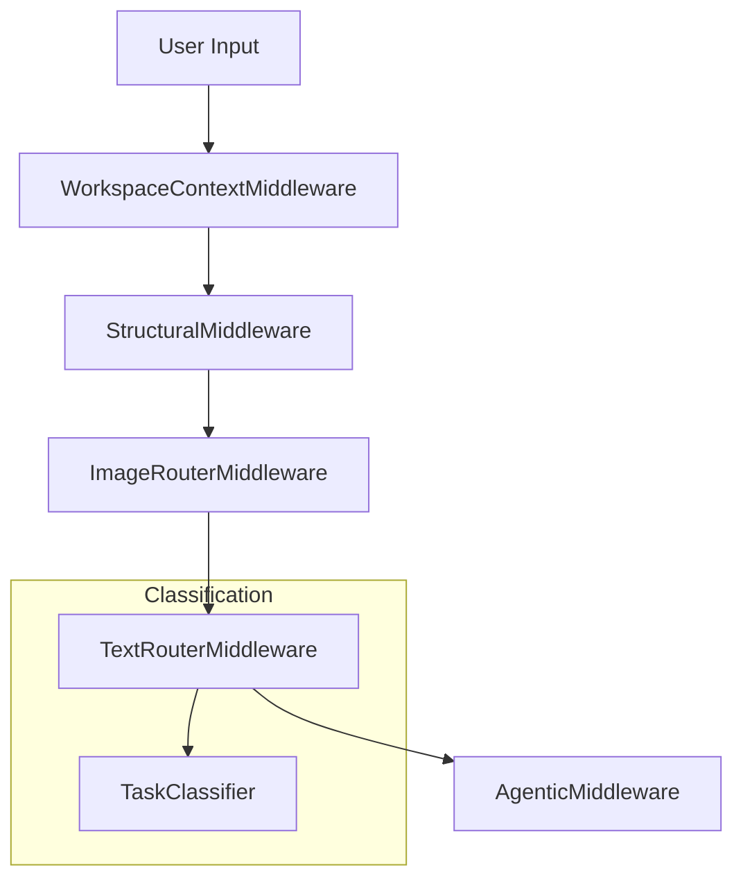

# Agentic Architecture & Steering Mechanics

This document provides a deep dive into the internal mechanics of the `@mcp:free-llm-apis` server, specifically the decoupled routing layers and the steering engine.

---

## 🛡️ Internal Grounding & Attestation Protocol

The pipeline enforces strict grounding to prevent hallucinations when performing project-scoped tasks.

### 🔄 Pre-emptive Memory Indexing
Triggered automatically for `agentic: true` requests in a valid workspace. The `WorkspaceContextMiddleware` runs a non-force indexing pass to ensure the LLM's vector search is grounded in the absolute latest state of the project files.

### 🏷️ Attestation Tags
The pipeline injects a **Grounding Protocol** into the system prompt of every LLM it calls. This forces the model to tag its claims:
- **`[RETRIEVED]`** — fact is directly present in injected context blocks (e.g., resolved `file://` or `artifact://` URIs, session memory).
- **`[NOT FOUND]`** — the file or context is mentioned but its content was not found or resolved. The model MUST stop and ask the user to provide it.

---

## 🤖 Decoupled Routing & Centralized Classification

The server features a **Context-Aware Steering Engine** (v1.0.6 Hardened) that manages stateful task execution via the `use_free_llm` tool. It splits routing responsibilities into specialized middlewares and centralizes task classification.



### 1. `ImageRouterMiddleware`
* **Responsibility**: Detects and processes multi-modal inputs.
* **Path Resolution**: Automatically scans messages for `file:///` URIs. If the URL points to a supported image format (`.png`, `.jpg`, `.jpeg`, `.webp`, `.gif`, `.avif`), it reads the file, converts it to base64, and routes the request to an available vision provider (e.g., Gemini or Llama-Vision). Text-only file references are ignored and passed down.

### 2. `TextRouterMiddleware`
* **Responsibility**: Routes text prompts to the most appropriate models.
* **Integration**: Uses `TaskClassifier.autoClassify` to infer the task type. If the task is a complex multiline goal, it automatically triggers the **Task Decomposition** loop to break it down into sequential subtasks.

### 3. `TaskClassifier`
* **Responsibility**: Centralizes all task classification heuristics.
* **Mechanics**: Uses single-pass compiled regexes with word boundaries (`\b`) and a keyword weighting map (`keywordTaskMap`) to classify the task type (e.g., `coding`, `reasoning`, `search`, `summarization`, `chat`) in under 0.05ms.

---

## 📂 Consolidated Pipeline Directory Layout

All core pipeline components and middlewares are consolidated under `src/pipeline/`:

```
mcp-server/src/
├── config/
│   └── models.ts             # Centralized model metadata & capabilities
├── pipeline/
│   ├── index.ts              # Pipeline exports
│   ├── instances.ts          # Singleton registry for middlewares
│   ├── middleware.ts         # Base PipelineExecutor & Middleware types
│   └── middlewares/
│       ├── AgenticMiddleware.ts       # Subtask decomposition & execution
│       ├── ImageRouterMiddleware.ts   # Image detection & vision routing
│       ├── TextRouterMiddleware.ts    # Text routing & task classification
│       ├── StructuralMiddleware.ts    # Session history & grounding context
│       ├── ResponseCacheMiddleware.ts # Cache lookup
│       ├── TokenManagerMiddleware.ts  # Token tracking & quota gates
│       └── WorkspaceContextMiddleware.ts # Workspace directory tree injection
└── utils/
    ├── FileUtils.ts          # Resilient atomic writes with retry-rename
    └── TaskClassifier.ts     # Centralized task classification
```
